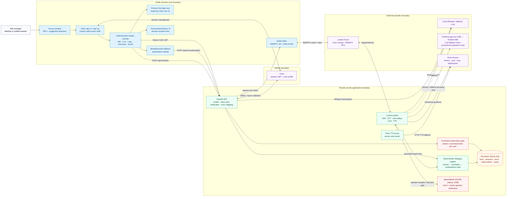
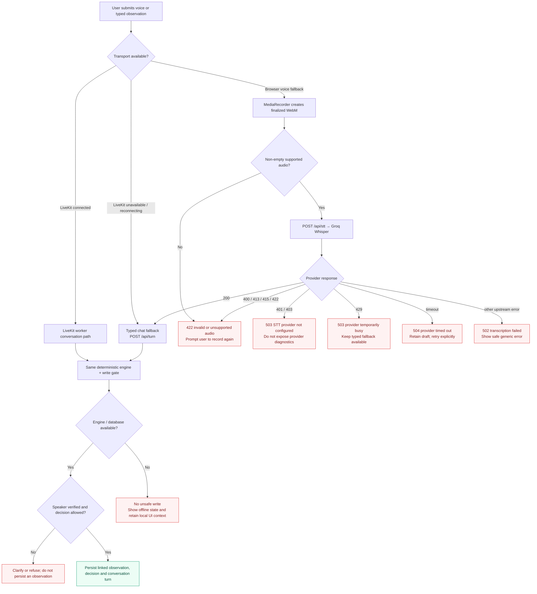
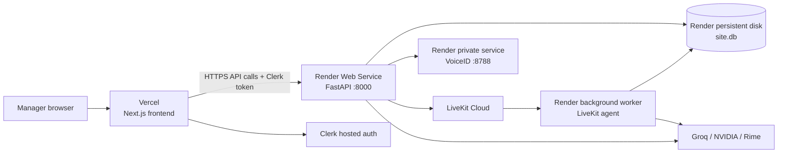

# Vesper architecture pipeline

Vesper is intentionally not a single chat completion. It is a set of separate,
bounded systems: the browser captures intent, Clerk supplies identity, LiveKit transports
live audio, deterministic rules decide safety-critical outcomes, and the language model only
phrases grounded responses. This document maps the production path and the degraded paths.

## 1. System and trust-boundary overview



## 2. Live voice: the critical request-to-record pipeline

```mermaid
sequenceDiagram
  autonumber
  actor M as Site manager
  participant B as Next.js browser
  participant C as Clerk
  participant A as FastAPI
  participant Q as Quota gate
  participant L as LiveKit Cloud
  participant W as LiveKit worker
  participant V as VoiceID sidecar
  participant S as Groq Whisper
  participant E as Deterministic engine
  participant D as SQLite
  participant X as LLM (Cerebras → NIM → Groq)
  participant R as Rime

  M->>B: Sign in / sign up
  B->>C: Authenticate
  C-->>B: Session JWT + Clerk user ID
  B->>A: POST /api/bootstrap-demo (only named demo email)
  A->>D: Seed first-run demo session + two safe sample turns once
  B->>A: POST /api/sessions with Bearer JWT
  A->>C: Verify JWT against issuer JWKS
  A->>D: Create / resume user-scoped session
  B->>A: POST /api/rtc/token
  A->>Q: Atomically reserve one of 3 free commands
  Q->>D: Persist used-command count
  alt quota available
    A-->>B: Signed LiveKit room token + room identity
    B->>L: Join room over WebRTC; publish microphone
    L->>W: Dispatch worker job for room
    W->>D: Read site brief, latest facts, RFIs, permits and hold points
    W-->>B: Publish greeting + structured site brief on data topic
    M->>B: Speak a site observation
    B->>L: Stream microphone frames
    L->>W: Audio stream + barge-in events
    W->>S: Streaming STT with construction vocabulary prompt
    S-->>W: Transcript
    W->>V: Verify enrolled speaker (rolling 4 s) and re-verify the command's own utterance before any write
    V-->>W: Similarity score / verified state
    W->>E: Brain.observe(verbatim transcript) — every finished turn, no LLM hop
    E->>D: Resolve current facts and rule views
    E-->>W: entities, blockers, contradictions, allowed decisions
    W-->>B: Publish structured result for evidence cards
    Note over W,R: every reply passes engine.speech.speakable() (short sentences, no typographic dashes, capped length) before Rime
    alt question
      W->>R: Speak engine answer (latest facts, open items) — LLM + recall only if unresolved
    else clean and verified
      W->>R: Stream engine read-back (mistv3/cove/eng over WebSocket)
      R-->>B: Spoken confirmation
      M->>B: Explicitly choose Log
      B->>L: Decision turn
      W->>E: log_observation
      E->>D: Persist linked observation + turn
    else contradiction, permit or hold-point blocker
      W->>R: Stream engine challenge with evidence and allowed choices
      R-->>B: Evidence-backed spoken correction
      M->>B: Choose RFI / NCR / Stop / Cancel / Log if allowed
      W->>E: Execute typed decision
      E->>D: Persist decision, linked IDs and history
    else speaker not verified or fields missing
      W-->>B: Ask for clarification; no write tool is enabled
    end
  else 3 commands already consumed
    A-->>B: 429 free_command_limit_reached
    B-->>M: Animated thank-you / upgrade boundary; no room token
  end
```

## 3. Browser typed-chat fallback and provider failure behaviour



## 4. Data ownership and security invariants

| Boundary | What crosses it | Enforced invariant |
| --- | --- | --- |
| Browser → API | Clerk bearer token, typed input or recorder blob | Server validates a configured Clerk issuer before attributing work to a deployed user. |
| API → quota store | Authenticated user ID | A room token is never minted after the atomic three-command reservation fails. |
| Browser ↔ LiveKit | WebRTC media, room token, structured data messages | Browser gets a short-lived room token, never LiveKit API secret. |
| Worker → engine | Verbatim transcript and explicit decision | LLM calls typed engine tools; it does not decide a contradiction or make a write directly. |
| Worker → VoiceID | Live speaker frames | An unverified speaker cannot unlock write decisions. |
| Engine → SQLite | Resolved IDs and decisions | Observations are linked to project facts/drawings rather than recorded as ungrounded prose. |
| Server → Groq / NIM / Rime | Provider requests | API credentials stay server-side; the browser never receives them. |

## 5. Deployment topology



The web service, agent worker and VoiceID sidecar intentionally deploy separately: a frontend
release cannot restart an active voice worker, and a LiveKit reconnect does not weaken the
HTTP chat fallback or the deterministic data store.
