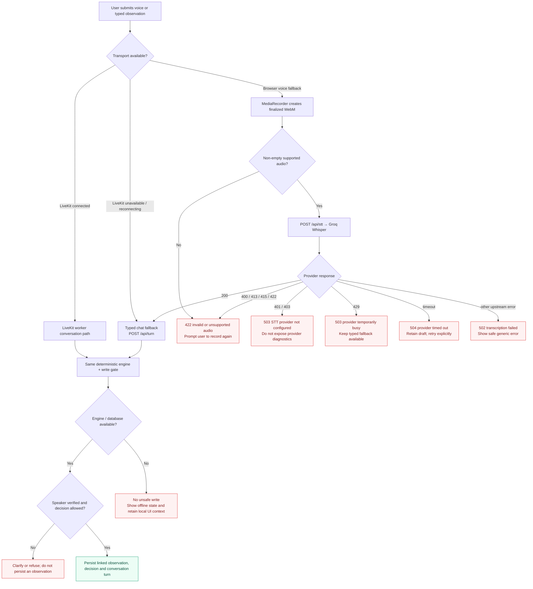
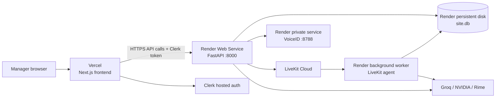
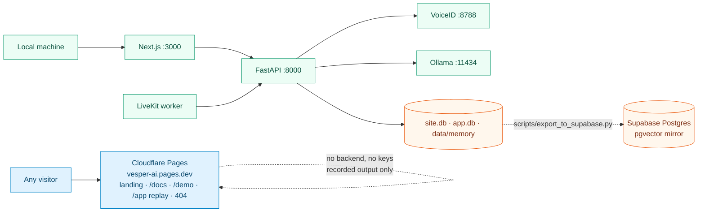
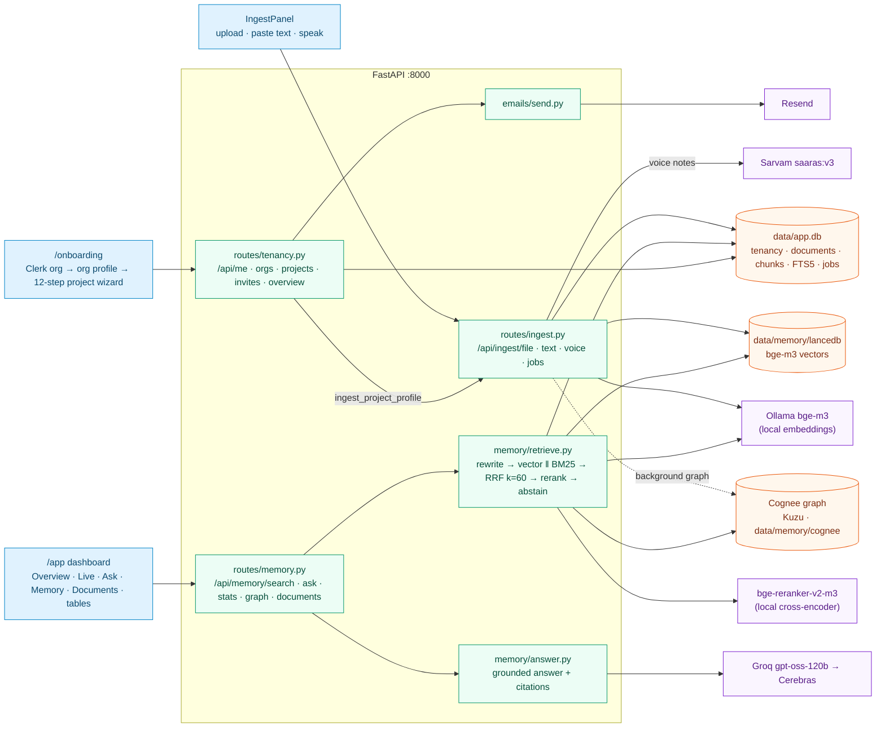
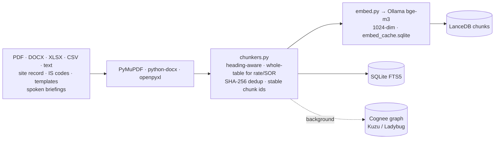
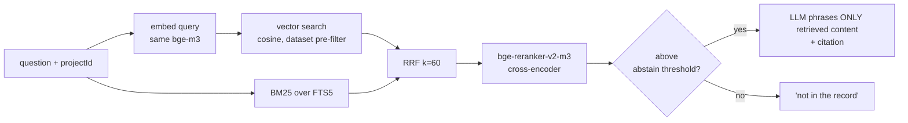

# Vesper architecture pipeline

Vesper is intentionally not a single chat completion. It is a set of separate,
bounded systems: the browser captures intent, Clerk supplies identity, LiveKit transports
live audio, deterministic rules decide safety-critical outcomes, and the language model only
phrases grounded responses. This document maps the production path and the degraded paths.

## 1. System and trust-boundary overview


## 2. Live voice: the critical request-to-record pipeline

```mermaid
sequenceDiagram
  autonumber
  actor M as Site manager
  participant B as Next.js browser
  participant C as Clerk
  participant A as FastAPI
  participant Q as Quota gate
  participant L as LiveKit Cloud
  participant W as LiveKit worker
  participant V as VoiceID sidecar
  participant S as Groq Whisper
  participant E as Deterministic engine
  participant D as SQLite
  participant X as LLM (Cerebras → NIM → Groq)
  participant R as Rime

  M->>B: Sign in / sign up
  B->>C: Authenticate
  C-->>B: Session JWT + Clerk user ID
  B->>A: POST /api/bootstrap-demo (only named demo email)
  A->>D: Seed first-run demo session + two safe sample turns once
  B->>A: POST /api/sessions with Bearer JWT
  A->>C: Verify JWT against issuer JWKS
  A->>D: Create / resume user-scoped session
  B->>A: POST /api/rtc/token
  A->>Q: Atomically reserve one of 3 free commands
  Q->>D: Persist used-command count
  alt quota available
    A-->>B: Signed LiveKit room token + room identity
    B->>L: Join room over WebRTC; publish microphone
    L->>W: Dispatch worker job for room
    W->>D: Read site brief, latest facts, RFIs, permits and hold points
    W-->>B: Publish greeting + structured site brief on data topic
    M->>B: Speak a site observation
    B->>L: Stream microphone frames
    L->>W: Audio stream + barge-in events
    W->>S: Streaming STT with construction vocabulary prompt
    S-->>W: Transcript
    W->>V: Verify enrolled speaker (rolling 4 s) and re-verify the command's own utterance before any write
    V-->>W: Similarity score / verified state
    W->>E: Brain.observe(verbatim transcript) — every finished turn, no LLM hop
    E->>D: Resolve current facts and rule views
    E-->>W: entities, blockers, contradictions, allowed decisions
    W-->>B: Publish structured result for evidence cards
    Note over W,R: every reply passes engine.speech.speakable() (short sentences, no typographic dashes, capped length) before Rime
    alt question
      W->>R: Speak engine answer (latest facts, open items) — LLM + recall only if unresolved
    else clean and verified
      W->>R: Stream engine read-back (mistv3/cove/eng over WebSocket)
      R-->>B: Spoken confirmation
      M->>B: Explicitly choose Log
      B->>L: Decision turn
      W->>E: log_observation
      E->>D: Persist linked observation + turn
    else contradiction, permit or hold-point blocker
      W->>R: Stream engine challenge with evidence and allowed choices
      R-->>B: Evidence-backed spoken correction
      M->>B: Choose RFI / NCR / Stop / Cancel / Log if allowed
      W->>E: Execute typed decision
      E->>D: Persist decision, linked IDs and history
    else speaker not verified or fields missing
      W-->>B: Ask for clarification; no write tool is enabled
    end
  else 3 commands already consumed
    A-->>B: 429 free_command_limit_reached
    B-->>M: Animated thank-you / upgrade boundary; no room token
  end
```

## 3. Browser typed-chat fallback and provider failure behaviour



## 4. Data ownership and security invariants

| Boundary | What crosses it | Enforced invariant |
| --- | --- | --- |
| Browser → API | Clerk bearer token, typed input or recorder blob | Server validates a configured Clerk issuer before attributing work to a deployed user. |
| API → quota store | Authenticated user ID | A room token is never minted after the atomic three-command reservation fails. |
| Browser ↔ LiveKit | WebRTC media, room token, structured data messages | Browser gets a short-lived room token, never LiveKit API secret. |
| Worker → engine | Verbatim transcript and explicit decision | LLM calls typed engine tools; it does not decide a contradiction or make a write directly. |
| Worker → VoiceID | Live speaker frames | An unverified speaker cannot unlock write decisions. |
| Engine → SQLite | Resolved IDs and decisions | Observations are linked to project facts/drawings rather than recorded as ungrounded prose. |
| Server → Groq / NIM / Rime | Provider requests | API credentials stay server-side; the browser never receives them. |

## 5. Deployment topology



The web service, agent worker and VoiceID sidecar intentionally deploy separately: a frontend
release cannot restart an active voice worker, and a LiveKit reconnect does not weaken the
HTTP chat fallback or the deterministic data store.

### What is actually deployed today

The topology above is the hosted plan. What runs right now is a split: the **public surface is static
on Cloudflare Pages** and carries no backend and no keys, while the engine, memory and voice stack run
locally.



| Surface | Where | Auth | Notes |
| --- | --- | --- | --- |
| Landing, Docs, demo, `/app` replay, 404 | Cloudflare Pages | none | `scripts/build_static_demo.sh deploy`; the build strips `/sign-in` and `/sign-out` links and fails if any secret-shaped string appears in the output |
| Dashboard, onboarding, live voice | local `:3000` + `:8000` | Clerk JWT | needs provider keys in `backend/.env.local` |
| Memory mirror | Supabase `ap-south-1` | service credentials | copy only; local SQLite + LanceDB stay authoritative |

The static build writes its own `404.html`, so the build explicitly copies `app/public/404.html` over
it — otherwise Cloudflare serves the framework default instead of the project's page.

## 6. v2: memory layer, tenancy and onboarding

v2 adds three things around the unchanged deterministic engine: a local memory layer for
knowledge questions, multi-tenant onboarding, and a laptop dashboard. The safety invariant is
unchanged — drawing facts, revisions, permits and hold points are still decided by the engine
over `site.db`; memory answers knowledge questions with citations and never authorises a log.



| Concern | Decision |
| --- | --- |
| Tenancy | Clerk Organization = client company; projects belong to an org. `tenancy/auth.py` reads org claims from Clerk session token v2 (`o.id`, `o.rol`) or v1; local dev uses `X-Vesper-User` / `X-Vesper-Org`. The seeded P1 project is read-only for everyone. |
| Isolation | Every chunk carries `scope, org_id, project_id, dataset`. A project search reads its own dataset plus the global `kb_*` datasets only. |
| Retrieval | bd-agent-style hybrid search (`docs/plan/research/02-bd-agent-rag.md`): LanceDB vectors and SQLite FTS5 BM25 run in parallel, fused with RRF (k=60), reranked by a cross-encoder, then an abstain threshold. Exact IDs (RFI-050, C-4, IS 456 Cl. 26.4) are why BM25 is kept. Responses carry `timingsMs` per leg. |
| Answering | Groq `gpt-oss-120b` (Cerebras fallback) answers only from retrieved context, quotes numbers verbatim, cites clause/template/drawing, and returns the exact abstain line when nothing relevant was found. |
| Ingestion | Heading-aware chunks, whole-table chunks for price/SOR/rate tables, SHA-256 dedup, stable chunk ids. Small uploads are searchable in seconds; Cognee graph extraction runs in the background. |
| Voice | Live STT is Sarvam `saaras:v3-realtime` (Groq Whisper fallback) followed by a conservative site-vocabulary normaliser (`agent/stt_normalize.py`). The agent can call `search_memory` for knowledge questions the record doesn't answer. |
| Ask is read-only | The dashboard's Ask page calls only `/api/memory/*`; it never falls back to `/api/turn`, which captures and logs observations. |

Detailed design and per-workstream reports: `docs/plan/PLAN.md`, `docs/plan/PROGRESS.md`,
`docs/plan/reports/`.

---

## 7. Application architecture in detail

### Processes, ports and what each one is trusted with

| Process | Port | Start | Trusted with |
| --- | --- | --- | --- |
| Next.js frontend | 3000 | `npm run dev` | Clerk **publishable** key only |
| FastAPI backend | 8000 | `uvicorn main:app` | Every provider key, all database access |
| Speaker ID sidecar | 8788 | `scripts/run_voiceid.sh` | ECAPA-TDNN voiceprints; fails closed |
| Ollama | 11434 | `ollama serve` | Local `bge-m3` embeddings; never leaves the machine |
| LiveKit agent worker | — | `agent/worker.py dev` | Joins rooms, runs the turn loop |
| Cognee graph worker | — | `backend/memory/cognee_worker.py` | Background entity/relationship extraction |

The browser never holds a provider secret. Rime, Sarvam, Groq/Cerebras/NVIDIA and Ollama are all
reached server-side; the only credential that reaches the client is the Clerk publishable key.

### Module map

| Concern | Modules |
| --- | --- |
| Deterministic engine | `extract` · `numbers` · `contradictions` · `dialogue` · `speech` · `answer` |
| HTTP surface | `backend/main.py` (v1 engine, STT/TTS proxies) · `routes/tenancy.py` · `routes/memory.py` · `routes/ingest.py` · `routes/tools.py` |
| Memory | `memory/ingest.py` · `chunkers.py` · `embed.py` · `store.py` · `retrieve.py` · `rerank.py` · `answer.py` · `cognee_worker.py` |
| Voice | `agent/worker.py` · `worker_prompts.py` · `engine_bridge.py` · `stt_normalize.py` · `voiceprofile.py` |
| Frontend clients | `lib/api.ts` · `api-v2.ts` · `api-tenancy.ts` — all three share one Clerk token getter |

### Speech endpoints

Both directions are server-side: the browser records or plays audio, but never holds a provider key.

| Endpoint | Body | Returns | Provider chain |
| --- | --- | --- | --- |
| `POST /api/stt` | multipart `file` (webm/wav), optional `language` | `{"text": "..."}` | Sarvam `saaras:v3` REST → Groq `whisper-large-v3` |
| `POST /api/tts` | `{"text", "language"}` (`en-IN` / `hi-IN`) | `audio/wav` from Sarvam, `audio/mpeg` from Rime | Sarvam `bulbul:v3` → Rime `mistv3` |
| `POST /api/rtc/token` | `{"projectId", "language", "name"}` | LiveKit room token; `projectId` and user ride in participant metadata | LiveKit |

Consumers: the live voice agent streams through LiveKit (Sarvam realtime STT in, Rime TTS out);
the Talk screen and **Ask memory** use the two HTTP endpoints — Ask's microphone button posts a
recording to `/api/stt` and drops the transcript into the question box, and its "Listen" button
plays `/api/tts` over the grounded answer.

Every reply passes `engine.speech.speakable()` before synthesis, so what is spoken is short,
unpunctuated by typographic dashes and length-capped, whichever provider serves it.

`AGENT_TTS_PROVIDER` picks the live agent's voice (Rime by default, as the problem statement names
it); `TTS_PROVIDER=rime` and `STT_PROVIDER=groq` pin a single provider for the web paths; `SARVAM_TTS_SPEAKER` and
`SARVAM_TTS_MODEL` choose the voice. Note that Sarvam retired `bulbul:v2`, and a v2-only voice such
as `anushka` raises at construction — the agent catches that and falls back to Rime rather than
joining a call mute.

### Two authentication modes, one switch

`CLERK_JWT_ISSUER` decides everything:

| Mode | Condition | Request must carry | Used by |
| --- | --- | --- | --- |
| Clerk | issuer set | `Authorization: Bearer <session JWT>`, verified RS256 against cached JWKS | deployment, real sign-in |
| Local | issuer empty | nothing, or `X-Vesper-User` / `X-Vesper-Org` / `X-Vesper-Role` | scenario runner, tests, offline demos |

Two independent verifiers implement this — `tenancy/auth.py` for the v2 routes and `_user_id()` in
`main.py` for the v1 engine routes. **They must be changed together**; instrumenting only one hides
the other's failures.

> **Operational trap, hit in practice.** RS256 verification requires the `cryptography` package.
> `requirements.txt` pins `PyJWT[crypto]`, but a virtualenv built without the extra raises
> `MissingCryptographyError` and **every** Clerk token fails with a generic `invalid sign-in token`,
> regardless of how valid it is. Both verifiers now log the underlying `PyJWTError` so the cause is
> visible in the server log while the client still sees only the generic message.

### Invariants that survive every path

1. A contradiction is decided by rules over SQL views, never by a model.
2. Nothing is written until a verified human explicitly decides.
3. The org comes from the verified project row, never from request arguments.
4. Memory can answer, cite and abstain — it can never authorise a log.

---

## 8. Memory layer in detail

Memory is deliberately separate from the rule engine. The engine decides *whether something is wrong*;
memory decides *what the record says*. Memory never authorises a write.

### Ingest



Each chunk stores `text` (what the answerer reads) separately from `embed_text` (what was embedded),
plus `entities` for exact-ID matching and a spoken `citation` string.

### Query



**Why both legs.** Vectors miss exact identifiers (`RFI-047`, `A-102@R4`, `IS 456 Cl. 26.4`); BM25
misses paraphrase. Both lists fuse with Reciprocal Rank Fusion, then a cross-encoder reranks the
survivors by reading query and passage together.

**One model, both ends.** The same `bge-m3` runs at ingest and at query time. Mixing embedding models
across those steps silently destroys recall and produces no error.

**Abstention is a feature.** Below threshold, Vesper says *"not in the record"* rather than letting the
LLM improvise, and numbers absent from the retrieved sources are stripped from the answer. Golden set:
recall@8 **1.000**, abstain precision and recall **1.000**, zero cross-project leaks.

### Isolation

Every chunk carries `scope`, `org_id`, `project_id` and `dataset`, named `<org>__proj_<project>`
(e.g. `org_local_demo__proj_NSK`). The dataset filter is applied **as a pre-filter inside the vector
search**, not as a post-hoc trim — another project's passages are never candidates in the first place.
Global knowledge lives in shared `kb_*` datasets that every project may read.

| Dataset | Chunks |
| --- | --- |
| `kb_is_codes` | 7,310 |
| `kb_templates` | 5,349 |
| `kb_prices_sor` | 4,131 |
| `kb_handbook` | 3,633 |
| `org_local_demo__proj_NSK` | 150 |
| `org_local_demo__proj_P1` | 141 |

### Storage and the online mirror

| Store | Holds | Size |
| --- | --- | --- |
| `data/memory/lancedb` | 20,734 bge-m3 vectors | 395 MB |
| `data/app.db` | 7,365 documents, 20,734 chunks, FTS5, tenancy | 80 MB |
| `data/site.db` | verified site record for the engine | 15 MB |
| `data/memory/cognee` | entity/relationship graph | — |
| Supabase `vesper.chunks` | `vector(1024)` + generated `tsvector` (GIN) | free tier |
| Neo4j Aura `vesper01` | Write-only backup of the Cognee graph (`scripts/export_graph_to_neo4j.py`) | free tier |

Postgres replaces FTS5 with a generated `tsvector` column and a GIN index; the vectors move into
pgvector. The mirror is a **copy**: local SQLite plus LanceDB remain authoritative, and
`scripts/export_to_supabase.py --verify` compares row counts on both sides.

### Latency

Warm hybrid search runs 20–130 ms per query over ~20k chunks on an Apple M3 (16 GB); the cross-encoder
rerank dominates that budget. A full cited answer lands in roughly 1–3 s, nearly all of it the LLM call.
Responses carry `timingsMs` per leg so a regression can be attributed rather than guessed at.

