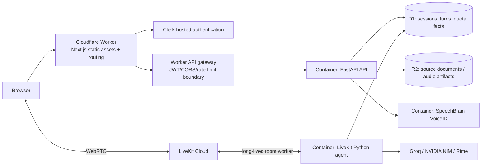

# Cloudflare hosting plan

## What can move now

| Workload | Cloudflare target | Migration level |
| --- | --- | --- |
| Public landing and authenticated Next.js UI | Workers with static assets (via OpenNext) | Low |
| API routing, CORS, rate limiting and secret boundary | Worker in front of the API | Medium |
| Existing FastAPI API | Cloudflare Container | Medium: container image + Worker proxy |
| SpeechBrain VoiceID sidecar | Separate Cloudflare Container | Medium: image plus authenticated private Worker route |
| LiveKit Python agent | Cloudflare Container | High: it is a persistent room worker, not an edge request handler |
| Shared SQLite database | D1 (or a single-instance temporary bridge) | High: repository layer migration required |

Cloudflare Workers themselves run JavaScript/TypeScript, not this Python FastAPI and
PyTorch workload. Cloudflare Containers are the correct compatibility layer because they run
container images in any language/runtime, but they are available on the Workers Paid plan and
are started and controlled through a Worker binding. [Cloudflare Containers documentation](https://developers.cloudflare.com/containers/)

## Recommended production topology

## Migration gates before production cutover

1. Replace the shared writable `site.db` path with D1-backed repository operations. A container
   filesystem is not a durable shared database across API and agent replicas.
2. Build one image for `backend/`, one for `voiceid/`, and one for `agent/`; configure their
   secrets only with `wrangler secret put` / the Cloudflare dashboard.
3. Add a Worker gateway that validates Clerk JWTs before forwarding to FastAPI and carries the
   verified subject in a signed internal header.
4. Provision an always-available route or lifecycle controller for the LiveKit agent. A request
   scoped container cannot replace a persistent room worker without this step.
5. Migrate the existing Render disk contents once into D1/R2, then run the acceptance scenarios
   and a real browser/phone conversation before switching DNS.

## Deployment outcome today

The public landing can be deployed to Cloudflare immediately once a Cloudflare account/token is
connected. The complete voice product should **not** be labelled deployed on Cloudflare until the
database and long-lived worker migration gates above are complete. This preserves the current
deterministic safety and speaker-verification behaviour rather than silently weakening it.
