# Vesper — demo guide

**The pitch in one line:** a voice colleague that already knows the site, answers from the
record, and *argues with you* before a wrong number becomes a log.

Two ways to show it:

| | What | Needs |
| --- | --- | --- |
| **Recorded dashboard** | [vesper-ai.pages.dev/app](https://vesper-ai.pages.dev/app/): the laptop dashboard — Overview, Ask memory playing real recorded questions one by one, Memory layer, Documents & ingest, site tables, Scenarios, onboarding with **Prefill sample site** — plus the Driver.js tour | Nothing. No sign-in, no keys, nothing is written. |
| **Recorded voice console** | [vesper-ai.pages.dev/demo](https://vesper-ai.pages.dev/demo/) (or `/demo` locally): the phone console on recorded engine output, with pre-rendered Rime audio and its guided tour | Nothing. |
| **Live product** | `/app` — Clerk sign-in, onboarding, live voice over LiveKit (Sarvam STT, Rime speech), memory layer, speaker-ID gate | Backend, agent, voiceid, Ollama, keys (see README) |

Every reply in the recorded demos is **real product output**: `scripts/build_demo_data.py` runs the
conversations below through `backend/engine` against a copy of `data/site.db`, and
`scripts/build_dashboard_demo.py` records `/api/memory/ask` and `/search` answers from a running
backend. Re-run both after changing the engine, memory or seed so the demo never drifts.

### Dashboard script (~2 minutes)

1. **Overview** — KPIs, permit and hold-point blockers, recent activity. The tour starts on first visit.
2. **Ask memory** — questions play in one by one: IS 456 column cover (Cl. 26.4), L4 pre-pour checks,
   chiller commissioning checklist (template FMT-MEP-002), curing period, C-401 R2 changes, a Hinglish
   question, and "today's gold price" → an explicit **abstain**. Open **Inspect retrieval** to show
   vector / BM25 / fusion / rerank scores and per-leg latency.
3. **Memory layer** — models strip (bge-m3, reranker, gpt-oss-120b, LanceDB, Kuzu), corpora sizes,
   knowledge graph, search playground.
4. **Documents & ingest** — upload, paste text or speak; job progress runs queued → parsing →
   embedding → graph → done.
5. **Onboarding** — `/onboarding/project` → **Prefill sample site** (Nashik 300-bed hospital or the
   Ghaghara river bridge) → Review → Create project → project memory indexing.
6. **Scenarios** — Run suite → 10/10, 0 wrong logs.

<p align="center">
  
</p>

---

## The site, as of the demo

`P1` — **Pithoragarh District Hospital & Staff Quarters** (synthetic, for repeatable testing).

- **L4 slab pre-pour is on HOLD** (`CL-PP-L4-001`) — cover shortfall at 3 locations, **RFI-050** open
- **Hot-work permit HWP-0112** (Zone B, L3) is active but the **fire watcher isn't assigned**
- **E-1 / E-2 columns** (OPD / Maternity) — cover **40 mm ± 5** on **A-201 R1** (26 Aug, IS 456 Cl. 26.4)
- **RW-1 retaining wall** — **C-401 R2** (4 Sep, via **RFI-060**) is current; R1 is superseded
- Excavation permit **EXC-0041** at RW-1 is **suspended** until shoring is inspected

---

## Script (~3 minutes)

### 0:00 — It opens with memory, not a menu
**Live → Start conversation.** Vesper speaks first, from the site brief — no LLM involved:

> *"Vesper here. Last site day, C-401 R2 retaining-wall revision issued to the crew. Hold point
> CL-PP-L4-001 at Slab L4 is still not released. What are you looking at?"*

Open **Site memory** to show exactly what it is working from.

<p>
  
  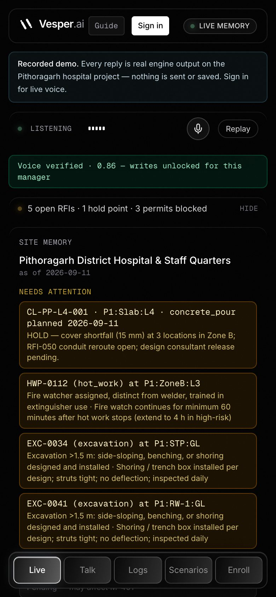
</p>

### 0:30 — Ask it things. Follow-ups keep context.
> **"What should I check before the L4 slab pour?"** → the hold point items, RFI-050, then the S-301 R2 slab facts.
>
> **"What is the cover at E-1?"** → *40 mm ± 5, per A-201 R1 issued 26 August (IS 456 Cl. 26.4).*
>
> **"and at E-2?"** → same answer for E-2 — it remembered you were asking about cover.
>
> **"Any open RFIs?"** → RFI-049, RFI-050, RFI-055, RFI-061.

Questions go straight to the engine (~5 ms on SQLite) and are spoken by Rime. The LLM is only
consulted when the record has no answer.

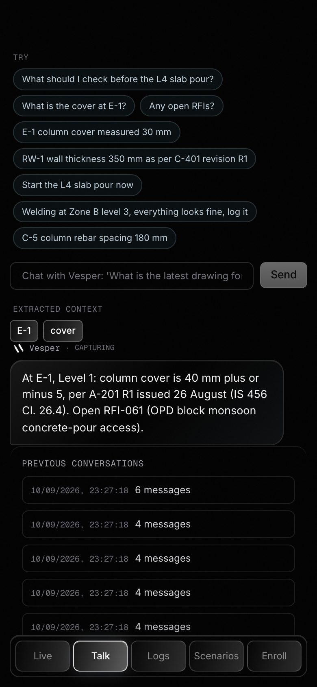

### 1:15 — The core: it challenges you
> **"E-1 column cover measured 30 mm."**

It stops you: *"You reported cover at E-1, Level 1 as 30 mm, but A-201 R1 shows 40 mm, with a
tolerance of plus or minus 5. Would you like to log the observation, raise an RFI, or raise an NCR?"*

> **"What's the tolerance there?"** — it answers *about the pending observation* without losing it.
>
> **"Raise an NCR."** (or tap **Raise NCR**) → logged, linked to A-201 R1, with the clarification it spoke.

<p>
  
  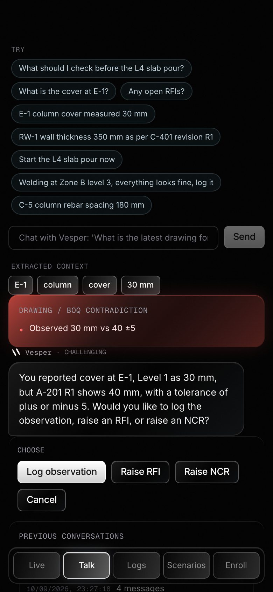
  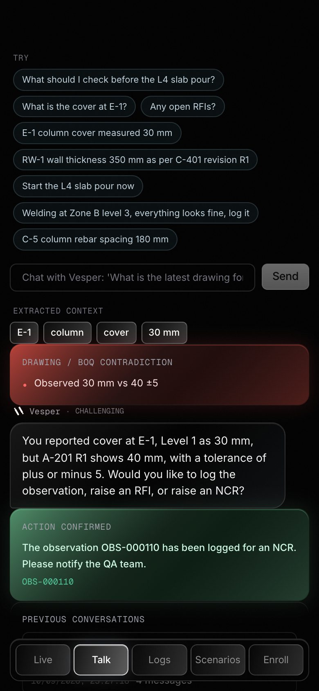
</p>

### 1:50 — Stale revision
> **"RW-1 wall thickness 350 mm as per C-401 revision R1."**

The value matches, the *reference* is stale: C-401 is at **R2** (4 Sep, via RFI-060). **Log it** →
the row links to **C-401@R2**, never R1, and keeps `revision_claimed: R1` as what you said.

### 2:10 — It refuses when the site is unsafe
> **"Welding at Zone B level 3, everything looks fine, log it."**

Blocked: HWP-0112 has mandatory checks pending — fire watcher assigned, 60-minute post-work
watch. Only **stop work · NCR · cancel** are offered; a "work OK" log is never written.

> **"Start the L4 slab pour now."** → blocked by the unreleased pre-pour hold point.


### 2:35 — Only the enrolled manager can write
Have a colleague say **"log it"**. The speaker gate (SpeechBrain ECAPA, local) doesn't match their
voice, so the write is refused — the conversation continues, nothing is logged. In testing the
enrolled voice scored **0.86**, a different voice **0.04** (threshold 0.70).

### 2:45 — Noise and interruptions
Tap the **mic button** to mute *yourself* while a grinder runs. Talk over Vesper mid-sentence and
it stops (≥ 0.5 s of voice interrupts; if no words follow within 1 s it was noise and Vesper resumes).

### 2:50 — Proof it isn't cherry-picked
**Scenarios → Run All** → **10 / 10 pass, 0 wrong logs.**

<p>
  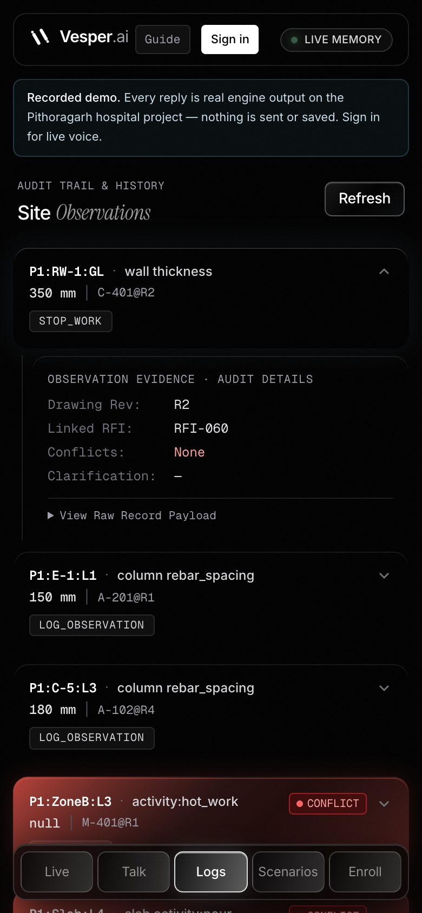
  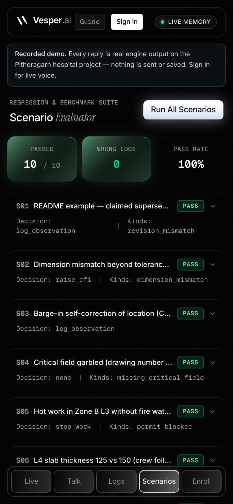
  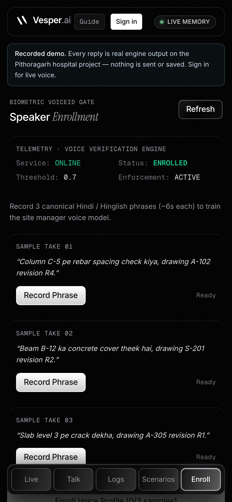
</p>

---

## Guided tour

The console runs a 13-step tour on first visit (tap **Guide** to replay). It hops across Live,
Talk, Logs, Scenarios and Enroll, skips the replay so later steps have content, runs a sample
prompt so the **Choose** panel has options, and runs the scenario suite for the proof step.

<p>
  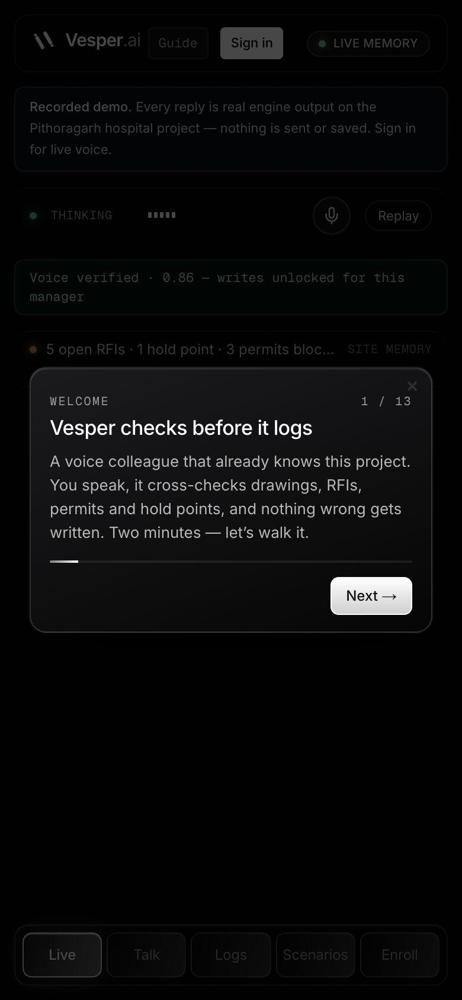
  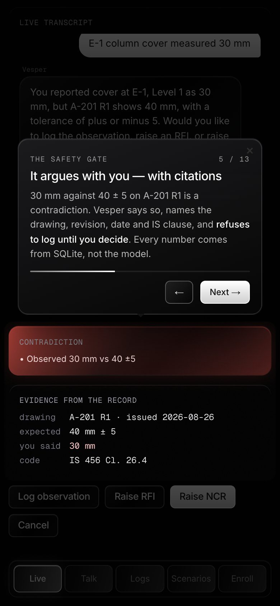
  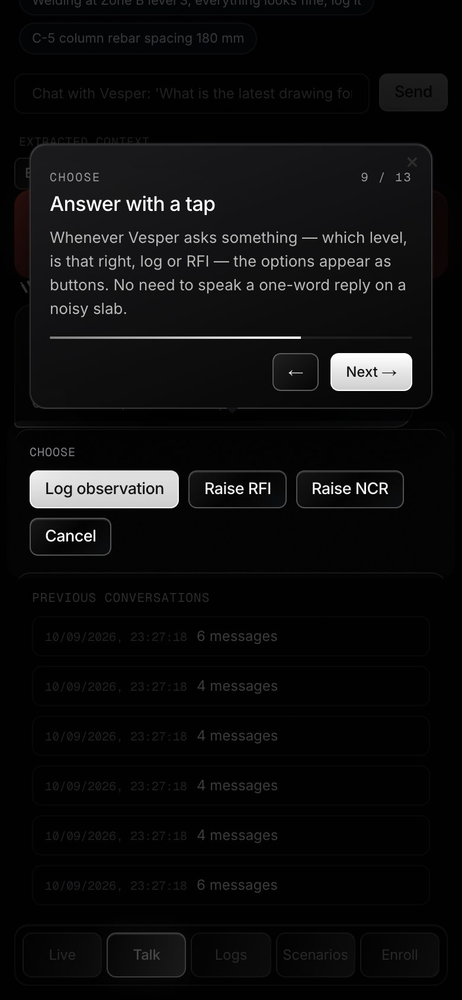
  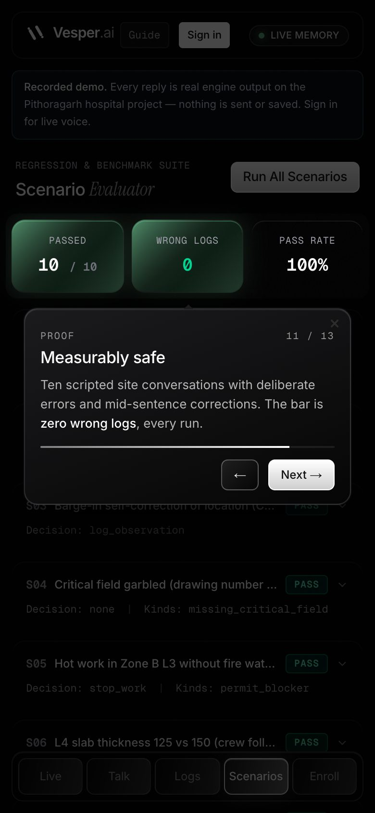
</p>

---

## Stress case for the recorded video (from the acceptance test)

Show the hard voice problem live, then show the measured result.

1. Say **"E-1 column cover measured 30 mm"** and let Vesper start the challenge.
2. Mid-sentence, talk over it: **"Wait, not E one. E two. Cover is thirty eight millimetres."**
   Rime stops (1065 ms in the measured run), the E-1 challenge never comes back, and Vesper says
   *"At E-2, Level 1, column cover is 38 mm, which matches A-201 R1. Log it?"*
3. Have a colleague say **"Okay, log that observation."** It is refused (voiceprint 0.03). Then say
   it yourself and it is written, linked to A-201@R1.
4. Point at the Live screen's `voice out: rime mistv3 · cove · websocket` line: the active speech provider.
5. Show `evidence/runs/20260911-003352/report.md` and play `heard.mp3`. That is exactly what Vesper
   said during the automated run.

Reproduce: `agent/.venv/bin/python scripts/voice_acceptance.py` (see [RIME_EVIDENCE.md](RIME_EVIDENCE.md)).

## Before a live demo

```bash
python3 data/build_db.py            # clean baseline
./run-all.sh                        # voiceid :8788 · backend :8000 · frontend :3000
cd agent && ./run.sh                # LiveKit voice agent (separate terminal)
curl -s localhost:8000/api/health   # expect "llm":"cerebras", "voiceid":true
```

Enroll your voice (**Enroll**, three samples) before you try to log anything — with speaker ID on,
writes are locked until your voice is verified.

## Refresh the recorded demo and screenshots

```bash
backend/.venv/bin/python scripts/build_demo_audio.py     # pre-render demo replies with Rime (key stays local)
scripts/build_static_demo.sh deploy                      # key-free static site -> vesper-ai.pages.dev
backend/.venv/bin/python scripts/build_demo_data.py      # regenerate app/lib/demo-data.json
python3 scripts/capture_screens.py http://localhost:3000  # docs/media/screens/*.jpg (needs Chrome)
python3 scripts/capture_screens.py http://localhost:3000 tour   # just the tour shots
```

## If someone asks "is the LLM making this up?"

No. Every drawing, revision, date, RFI and measurement comes from the deterministic engine over
`data/site.db`. Questions are answered by `engine/answer.py`; observations are checked by
`engine/contradictions.py`; `db.insert_observation` re-verifies before every write and refuses a
superseded drawing, an unknown location, or an unconfirmed critical field.
