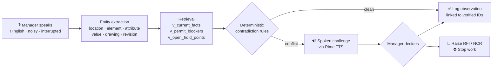

<div align="center">

# 🏗️ Vesper.ai

### Voice-led operational memory for construction sites

*The agent already knows your site. It challenges you **before** you log something wrong.*

<br/>


</div>

---

## 1. Short Summary

**Vesper** is a real-time, full-duplex voice agent for site managers on Indian construction
projects. You can talk in English or Hinglish, on a noisy site, and it talks back — grounded entirely in
the project's own record: tender/BOQ, drawing revisions, RFIs, submittals, daily progress
reports, permits and QA/QC checklists.

Its defining behaviour is that it **argues with you**. When your spoken observation contradicts
the latest *For Construction* drawing, an unreleased hold point, or an unsatisfied permit check,
Vesper stops the log, says exactly what the record shows, and asks you to decide — log, raise an
RFI, raise an NCR, or stop work. Every number it speaks comes out of SQLite; none of it is
invented by the model.

> **Voice is the safety gate, not a transcription box.**

---

## 2. Problem Statement

Site managers live inside a fragmented information environment — tender/BOQ, the drawing
register, RFIs, submittals, DPRs, permits, QA checklists, plus a river of WhatsApp voice notes.

The real failure mode is **not missing data**. It is *contradictions* between:

| what was **tendered** | what is being **built** | what is **reported today** |
| :---: | :---: | :---: |

…and those contradictions surface only at the worst possible moment — rework, a payment dispute,
or an incident.

Procore, Aconex, RIB and SiteSetu unify documents into dashboards very well. But the manager
still has to correlate *a spoken observation* with *the right drawing revision / BOQ item / RFI*
**by hand, from memory, under time pressure.** And voice, today, is dictation or shallow Q&A —
it faithfully records the wrong number.

**A wrong number logged confidently is worse than no log at all.**

---

## 3. Our Approach

Vesper reframes voice from *capture* to *verification*. The runtime loop:



**1 · It opens with memory, not a menu.** Before it says a word, the agent has read the last
DPRs, open RFIs, submittals and hold points. It greets you with the actual state of the job —
*"Yesterday you were on L4 slab top bars and the pre-pour is still on hold over the cover
shortfall, RFI fifty is open."*

**2 · Extraction, then a deterministic check — not a vibe check.** The utterance becomes a
structured claim. Contradictions are decided by **rules over SQL views**, never by the LLM:

| Rule | Fires when |
| --- | --- |
| `dimension_mismatch` | spoken value ≠ latest fact, beyond stated tolerance |
| `revision_mismatch` | revision you cited ≠ latest *For Construction* revision |
| `permit_blocker` | a mandatory permit check is unsatisfied |
| `hold_point_blocker` | a QA/QC hold point has not been released |

**3 · It challenges you out loud, in your language.** Rime TTS speaks the correction in
Hinglish, with citations: *"Drawing A-102 ki latest revision R4 hai, jo 12 August ko issue hui
thi. Usme spacing 180 mm hai. RFI-047 ne yeh confirm kiya tha. Kya aap observation log karna
chahte hain, ya RFI raise karna chahte hain?"*

**4 · Nothing is written until a verified human decides.** A local **SpeechBrain ECAPA-TDNN**
speaker gate verifies it is the enrolled manager speaking before any logging tool can fire. If a
critical field is still uncertain, the agent **refuses to log** and asks again.

**5 · The LLM is on a short leash.** Every finished turn goes straight into the engine
(~5 ms on SQLite): observations are checked, questions such as *"what is the cover at E-1?"* or
*"and at E-2?"* are answered from the latest For-Construction facts, open hold points, permits
and RFIs (`engine/answer.py`), and the approved reply is spoken with Rime. The LLM is only asked
when the record has no answer, and then only through its `recall` tool — so a rate-limited
provider can no longer leave the live conversation silent.

---

## 4. Tech Stack

| Layer | Technology | Role |
| --- | --- | --- |
| **Frontend** | Next.js 16 · React 19 · TypeScript · Tailwind v4 | Live / Observations / Scenarios / Enroll screens, site-memory panel |
| **Voice transport** | LiveKit Agents + `livekit-client` (WebRTC) | Real-time full-duplex audio, barge-in, interruption handling |
| **STT** | Groq Whisper (`livekit.plugins.groq`) | Hinglish speech → text on noisy sites |
| **TTS** | **Rime** (Arcana) via server-side proxy | Natural Hinglish spoken challenges; API key never reaches the browser |
| **LLM** | Cerebras `gpt-oss-120b` *primary* → NVIDIA NIM → Groq (LiveKit `FallbackAdapter`) | Only for questions the engine cannot answer from the record; grounded by `recall` |
| **VAD** | Silero | Turn detection / barge-in |
| **Backend** | FastAPI + Uvicorn (`:8000`) | Deterministic engine, TTS proxy, speaker gate, scenario runner |
| **Engine** | Pure Python — `extract` · `numbers` · `contradictions` · `dialogue` · `replies` | Rule-based, testable, no model in the decision path |
| **Speaker ID** | SpeechBrain **ECAPA-TDNN** + PyTorch (CPU), FastAPI sidecar (`:8788`) | Cosine-similarity verification against the enrolled manager |
| **Data** | SQLite + `better-sqlite3` / stdlib `sqlite3` | 20 tables + 4 views (`v_current_facts`, `v_latest_drawings`, `v_permit_blockers`, `v_open_hold_points`) |
| **Testing** | Vitest (TS) · `scenarios.py` (S01–S10 acceptance harness) | Pass/fail table for scripted error + barge-in scenarios |

For the full request, identity, voice, safety, data, failure and deployment flows, see
[ARCHITECTURE.md](ARCHITECTURE.md). The captured authentication walkthrough is available as
[`docs/media/vesper-auth-flow.gif`](docs/media/vesper-auth-flow.gif).

---

## 5. Run It Locally

**Prereqs:** Python 3.12+, Node 20+, a Chromium browser, and a filled-in `.env`
(`RIME_API_KEY`, `GROQ_API_KEY`, `NVIDIA_API_KEY`, `LIVEKIT_*`). Start from the
placeholder-only template; never put credentials in source code or client-side variables.

```bash
# 0 — configure local secrets (the copied file remains gitignored)
cp .env.example .env

# 1 — build the project database (idempotent: run twice, get the same DB)
python3 data/build_db.py

# 2 — start all three services: voiceid :8788 · backend :8000 · frontend :3000
./run-all.sh

# 3 — in a second terminal, start the LiveKit voice agent
cd agent && ./run.sh
```

Then open **http://localhost:3000** → **Enroll** → record 3 live voice samples → **Live**.

The protected console opens on **Live** by default; **Talk** is the typed/push-to-talk fallback.
If the console ever reports `Session start failed`, verify the backend first, then restart only
that service:

```bash
curl -fsS http://127.0.0.1:8000/api/health
cd backend && ./run.sh
```

The Logs view refreshes automatically while it is open. A LiveKit room may need a disconnect and
reconnect after starting the local agent worker.

> ⏳ The first `voiceid` boot downloads the ECAPA model (~80 MB) once.

<details>
<summary><b>Health checks & individual services</b></summary>

```bash
curl -s localhost:8000/api/health      # backend
curl -s localhost:8788/health          # speaker ID

./voiceid/run.sh                       # speaker ID only
./backend/run.sh                       # backend only
cd app && npm run dev                  # frontend only
```
</details>

<details>
<summary><b>Acceptance test — 10 scripted scenarios</b></summary>

Ten scenarios (S01–S10) carry deliberate errors and barge-in. **Pass** = all ten behave as
expected **and** zero observations are logged against the wrong drawing / dimension / location,
with every contradiction producing a spoken clarification first.

```bash
cd backend && PYTHONPATH=. .venv/bin/python scenarios.py
# or: POST http://localhost:8000/api/scenarios/run
```
</details>

<details>
<summary><b>Repository layout</b></summary>

```
app/                Next.js frontend (:3000) — Live · Observations · Scenarios · Enroll
  lib/engine/         TS reference implementation of the engine
  lib/parser/         extract · numbers
agent/              LiveKit voice agent worker
  worker.py           STT → LLM (tool-calling) → TTS pipeline
  engine_bridge.py    typed tools into the deterministic engine
  voiceprofile.py     speaker gate wiring
backend/            FastAPI (:8000)
  CONTRACT.md         frozen HTTP + engine interface — all workstreams build to this
  engine/             extract · answer · contradictions · dialogue · memory · replies · llm
  scenarios.py        S01–S10 acceptance harness
voiceid/            SpeechBrain ECAPA speaker-ID sidecar (:8788) + enroll.py
data/
  schema.sql          SQLite schema (shared contract)
  build_db.py         builds site.db from raw/ + seed/
  seed/               demo project P1 + scenarios.json
  DATA.md             build steps, row counts, sanity checks, known gaps
app/public/landing/ Marketing landing page (the only one; served at /)
DEMO.md             ~3 min live-mic demo script
.env                Secrets — gitignored, never commit
```
</details>

### Seeded demonstration project

`P1` is a **synthetic Pithoragarh District Hospital & Staff Quarters** project, designed for
repeatable safety testing rather than use as issued construction information. It includes OPD and
maternity columns E-1/E-2, the RW-1 ambulance-road retaining wall, hospital water tank WT-1,
revisioned drawings, RFI-060, monsoon DPRs, permits, hold points, observations and the cached
QA/QC library. Rebuild it at any time with `python3 data/build_db.py`.

Never treat seeded measurements as real-site approvals: production projects must ingest their
own approved drawings, RFIs, permits and inspection records before Vesper is used for decisions.

---

## 6. USPs

<table>
<tr>
<td width="50%" valign="top">

### 🛑 It challenges, it doesn't dictate
Every other voice tool records what you said. Vesper checks what you said against the
**latest For-Construction revision** and stops you *before* a wrong number becomes a record.

</td>
<td width="50%" valign="top">

### 🧠 Opens with memory, not a menu
No "which project?", no "who are you?". It has already read the last three DPRs, the open
RFIs and the hold points, and starts the conversation there.

</td>
</tr>
<tr>
<td width="50%" valign="top">

### 🔒 Deterministic where it matters
Contradictions come from **SQL views + explicit rules**, not from a language model. The LLM
phrases the sentence; it never decides whether you are wrong.

</td>
<td width="50%" valign="top">

### 🗣️ Hinglish-native, site-noise-real
Built for how Indian sites actually speak — code-switched, interrupted, loud. Groq Whisper in,
**Rime** Hinglish out, Silero VAD for genuine barge-in.

</td>
</tr>
<tr>
<td width="50%" valign="top">

### 👤 Voiceprint-gated writes
A local SpeechBrain ECAPA-TDNN model verifies the enrolled manager on every turn. No verified
speaker → **no write**, ever. Runs on-device, no key, no cloud round-trip.

</td>
<td width="50%" valign="top">

### 🚫 Refuses when uncertain
If a critical field is ambiguous, Vesper declines to log and asks again. Silence beats a
confident hallucination on a live pour.

</td>
</tr>
<tr>
<td width="50%" valign="top">

### 🔗 Every observation is traceable
Logs are written linked to a verified `drawing_id`, `location_id` and decision — not free text.
The audit trail is a foreign key, not a paragraph.

</td>
<td width="50%" valign="top">

### ✅ Measurably safe, not vibes-safe
A 10-scenario acceptance harness with deliberate errors and barge-in. The bar isn't "sounds
good" — it's **zero wrong logs**.

</td>
</tr>
</table>

---

<div align="center">
<sub>Built for DataForge × Rime · Demo script in <a href="./DEMO.md">DEMO.md</a> · Data notes in <a href="./data/DATA.md">DATA.md</a></sub>
</div>

---

## 7. Rime voice contract and evidence

The explicit Hinglish mode uses the organizer configuration — **model `arcana`**, **speaker
`astra`**, and **language `hin`**. The default English Talk mode uses **model `mistv3`**,
**speaker `cove`**, and **language `eng`**, matching the low-latency LiveKit worker. Vesper sends an HTTPS `POST` with JSON and Bearer authentication to
`https://users.rime.ai/v1/rime-tts`, requests `audio/mp3`, and returns `audio/mpeg` from
`POST /api/tts` to one browser `<audio>` element. The API key stays server-side.

Run the non-secret preflight before a demo or deployment:

```bash
python3 scripts/rime_preflight.py --env-file backend/.env.local
python3 scripts/rime_preflight.py --env-file backend/.env.local --request
```

The full claim, procedure, tested result, and limitations are in
[RIME_EVIDENCE.md](./RIME_EVIDENCE.md).

## 8. Third-party services and failure behavior

| Service | Purpose | Failure behavior |
| --- | --- | --- |
| Rime | Spoken agent responses | `/api/tts` returns an error; the Talk screen falls back to browser speech synthesis and shows a missing/unavailable Rime status. |
| Groq | Whisper STT and LLM fallback | A failed STT request is surfaced to the user; typed observations remain available. |
| Cerebras / NVIDIA NIM | LLM for questions the engine cannot resolve (Cerebras first, NVIDIA next, Groq last) | Fallback moves to the next provider on error or 6 s timeout; engine answers never depend on it. |
| LiveKit Cloud | Full-duplex browser/worker voice transport | Token minting fails clearly if configuration is missing; typed Talk mode remains available. |
| SpeechBrain sidecar | Per-account speaker verification (one voiceprint per Clerk user) | Fails closed: unenrolled, unmatched, or sidecar down → write decisions are locked (questions still answered). |

## 9. Authentication and deployment

Clerk is the account-authentication layer: `/` remains public and `/app` is protected by
`app/proxy.ts`. After sign-in the console shows the Clerk account menu. The voice enrollment
service is deliberately a **step-up control**, not the only identity factor: speech can be
replayed or misclassified, so a verified account remains required for access.

Each signed-in account receives exactly **three** complimentary commands across typed chat,
push-to-talk, and a new LiveKit room. The FastAPI service verifies the Clerk JWT and atomically
tracks the allowance in SQLite before it processes a command. After the third command, the UI
shows a thank-you state and retains the conversation archive; refreshes and concurrent tabs
cannot add a fourth command. Set `CLERK_JWT_ISSUER` and `FREE_COMMAND_LIMIT=3` in Render.

The deployment is split by workload:

| Host | Services | Why |
| --- | --- | --- |
| Vercel | `app/` Next.js frontend | Edge delivery and Clerk-protected browser console |
| Render | FastAPI API, private VoiceID sidecar, persistent LiveKit agent worker | The API needs a writable data disk; the agent must stay connected to LiveKit; the model sidecar stays off the public internet |

`render.yaml` is the repeatable Render Blueprint and `voiceid/Dockerfile` includes its required
FFmpeg runtime. Create the Render Blueprint from this repository, set every `sync: false` value
in Render's secret manager, then copy the resulting API URL into Vercel as
`NEXT_PUBLIC_API_BASE` and redeploy the frontend. Do not store keys in `render.yaml`, Vercel
source files, or Git.

The public landing is currently deployed to Cloudflare Pages at
[vesper-ai.pages.dev](https://vesper-ai.pages.dev). It is intentionally a landing-only deployment:
it does **not** host the FastAPI, VoiceID or persistent LiveKit worker, so it must not be used as
the live console URL.

Cloudflare can host the full product through a Worker gateway plus Containers, but the configured
account must have Workers Paid/Containers access and Docker must be running to build/publish the
images. The migration plan is in [CLOUDFLARE_DEPLOYMENT.md](./CLOUDFLARE_DEPLOYMENT.md): persist
shared data in D1/R2 before production cutover, then deploy the FastAPI, VoiceID and LiveKit
agent containers behind a Clerk-validating Worker. `wrangler containers list` currently verifies
whether that prerequisite is enabled.

For a CLI deployment after the host accounts are authenticated:

```bash
# Vercel frontend (run from the Next app)
cd app && npx vercel --prod

# Render validates the infrastructure file; create/sync the Blueprint in Render
render blueprints validate render.yaml
```

## 10. Known limitations before production deployment

- The current backend acceptance harness passes all 10 scenarios with zero wrong logs. It is a
  scripted test, not a substitute for a site pilot.
- Browser STT now distinguishes invalid/unfinalized audio (`422`) from a provider failure
  (`502`/`503`/`504`); valid WAV transcription succeeds against Groq. More real-device samples
  are still useful before production.
- Desktop, tablet, and mobile browser layout checks pass. A full physical-phone LiveKit
  conversation validation remains pending.
- The Rime proxy buffers the upstream response; it is not true chunked audio streaming.
- Rime, Groq, NVIDIA, and LiveKit are external services: credentials, quota, latency, and network availability affect live behavior.
- Cloudflare Pages is live for the landing only. End-to-end Cloudflare deployment remains blocked
  until Containers access is enabled and the SQLite-to-D1/R2 migration is completed.
