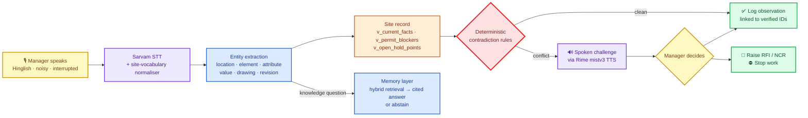
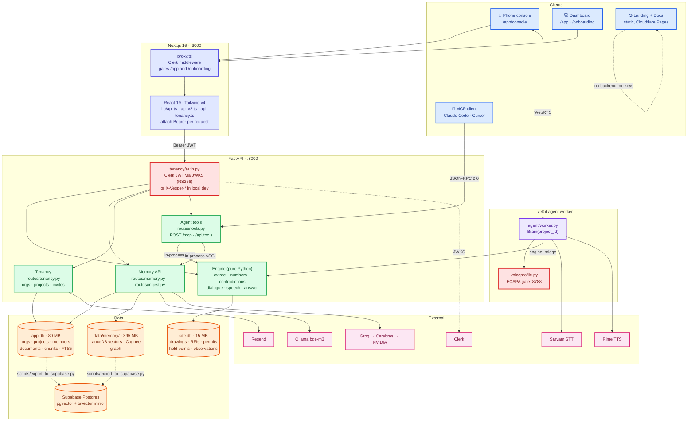
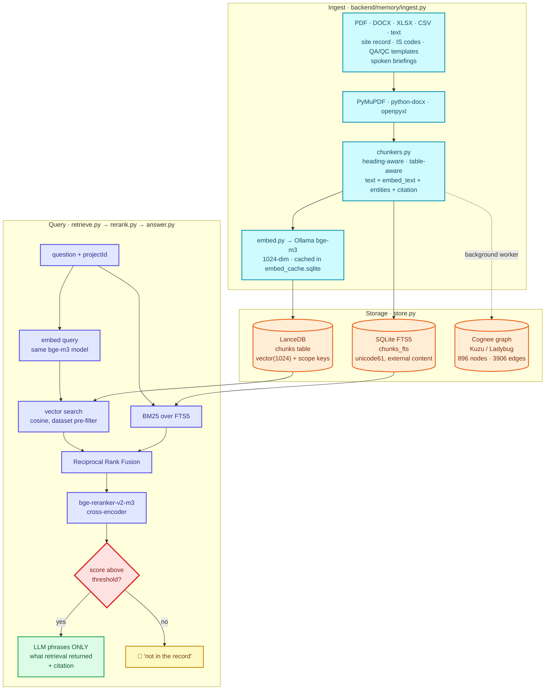

<div align="center">

# 🏗️ Vesper.ai

### Voice-led operational memory for construction sites

*The agent already knows your site. It challenges you **before** you log something wrong.*

<br/>


**[Try the dashboard](https://vesper-ai.pages.dev/app/)** · **[Hear the voice demo](https://vesper-ai.pages.dev/demo/)** · [Demo script](DEMO.md) · [Architecture](ARCHITECTURE.md) · [Rime evidence](RIME_EVIDENCE.md)

<br/>


**Closed 2026-09-16.** All workstreams complete: 10/10 P1 and 8/8 NSK scenarios with zero wrong logs,
memory at recall@8 1.000 with no cross-project leaks, Clerk auth live, MCP server documented, and the
public site deployed. Status board and close-out notes: [docs/plan/PROGRESS.md](docs/plan/PROGRESS.md).

</div>

---

## 1. Short summary

**Vesper** is a real-time, full-duplex voice agent and laptop dashboard for site managers on Indian
construction projects. You talk in English, Hindi or Hinglish on a noisy site, and it talks back —
grounded in the project's own record (drawing revisions, RFIs, submittals, DPRs, permits, QA/QC
checklists, BOQ) and in a local memory of IS codes, 550 QA/QC/PMC templates, price and rate
references, thumb rules and every document the team uploads.

Its defining behaviour is that it **argues with you**. When a spoken observation contradicts the latest
*For Construction* drawing, an unreleased hold point or an unsatisfied permit check, Vesper stops the log,
says exactly what the record shows, and asks you to decide — log, raise an RFI, raise an NCR, or stop work.
Safety decisions come from deterministic rules over SQLite; knowledge answers come from retrieval with
citations, or an explicit "that isn't in the record".

> **Voice is the safety gate, not a transcription box.**

### What Vesper does that a site system usually cannot

**It answers against the current revision, not the one in your head.** Say *"C-5 pe spacing 180, A-102 rev
teen mein 200 dikh raha hai"* and Vesper replies with **A-102 R4 — 180 c/c ± 10, reissued after RFI-047 for
ductile detailing (IS 456 Cl. 26.5.3.2(c))**. The superseded number never reaches the log. Revision chains,
change notes and the RFI that caused the change are all in the record.

**It stops a wrong number before it becomes rework.** A spoken value is checked against the drawing fact,
its tolerance and its clause. Cover 25 mm at B-4 against 40 ± 5 does not get logged as "cover done" — it
becomes a challenge, and then an NCR if you say so. Five rules decide this, all of them SQL over the site
record: `dimension_mismatch`, `revision_mismatch`, `unknown_drawing`, `permit_blocker`, `hold_point_blocker`.

**It refuses unsafe work out loud.** Ask to log welding in Zone B Level 3 as fine and it names the permit
that is not satisfied — *HWP-0112, fire watcher not assigned, fire watch to continue 60 minutes after work
stops* — and offers stop-work. Pre-pour hold points behave the same way: the L4 pour is held while cover
shortfall and RFI-050 are open, pump and RMC truck at the gate notwithstanding.

**It knows the codes, the checklists and the rates, and it cites them.** IS 456, IS 1893, IS 13920,
IS 10262, NBC 2016 Part 4, IRC and ISO clause text, 550 ITP / QA-QC / PMC templates with acceptance criteria,
and 1,399 CPWD DSR rate items. Ask what the DSR rate for M30 is and you get ₹8,400/cum for raft against
₹8,650/cum for columns — two line items, cited separately, not averaged into a number nobody can defend.

**It says "not in the record" instead of inventing.** No Level 7 on this job means no answer about a
Level 7 lift shaft door — the LLM is never called. Abstain precision and recall are both 1.000 on the
43-question golden set, with zero cross-project leaks.

**It works the way a site actually talks.** English, Hindi and Hinglish in one sentence, drill noise at
5 dB SNR, and mid-sentence corrections — *"wait, not E-1, E-2"* — cut the spoken reply off in ~1 s and the
engine keeps the correction, never the original.

**Only the enrolled manager can write.** A local voiceprint gate verifies the speaker on the utterance that
carries the command, not once at login; an unenrolled voice scores 0.03 against a 0.70 threshold and nothing
is written. Every turn is stored with the drawing revision it was checked against, so any log can be audited
after the fact.

**Everything the site produces becomes memory.** Drawings, BOQ, DPRs, RFIs, submittals, permits, checklists
in PDF / DOCX / XLSX / CSV, pasted text, or a spoken briefing at the end of the day — chunked, embedded and
citable within seconds, isolated per project so two clients can never see each other's job.

**One console for the whole job.** Client company onboards as an organization, a 12-step wizard (92
real-world fields) turns the project's own facts into its first memory, and the laptop dashboard carries
site tables, Ask memory with a retrieval inspector, the knowledge graph, the audit trail and the scenario
suite. The phone console is what the manager carries on site.

**And the judgement never leaves the laptop.** Embeddings, reranking, the vector store, the record, the
graph and the speaker gate all run locally. Cloud services carry audio, phrasing and sign-in only — so an
expired provider key changes the voice, not the verdict.

---

## 2. Problem statement

Site managers live inside a fragmented information environment — tender/BOQ, the drawing register, RFIs,
submittals, DPRs, permits, QA checklists, IS codes, plus a river of WhatsApp voice notes.

The real failure mode is **not missing data**. It is *contradictions* between:

| what was **tendered** | what is being **built** | what is **reported today** |
| :---: | :---: | :---: |

…and those contradictions surface only at the worst possible moment — rework, a payment dispute, or an incident.

Procore, Aconex, RIB and SiteSetu unify documents into dashboards very well. But the manager still has to
correlate *a spoken observation* with *the right drawing revision / BOQ item / RFI / code clause* **by hand,
from memory, under time pressure.** Voice today is dictation or shallow Q&A — it faithfully records the wrong number.

**A wrong number logged confidently is worse than no log at all.**

---

## 3. Our approach

Vesper reframes voice from *capture* to *verification*:



**1 · It opens with memory, not a menu.** The agent has read the last DPRs, open RFIs, submittals and hold
points, and greets you with the actual state of the job.

**2 · Extraction, then a deterministic check — not a vibe check.** The utterance becomes a structured claim.
Contradictions are decided by **rules over SQL views**, never by the LLM:

| Rule | Fires when |
| --- | --- |
| `dimension_mismatch` | spoken value ≠ latest fact, beyond stated tolerance |
| `revision_mismatch` | revision you cited ≠ latest *For Construction* revision |
| `unknown_drawing` | the drawing you cited isn't in the register |
| `permit_blocker` | a mandatory permit check is unsatisfied |
| `hold_point_blocker` | a QA/QC hold point has not been released |

**3 · It challenges you out loud.** Rime `mistv3` (`wildflower`) speaks the correction with citations
and the choices you have. Sarvam `bulbul` speaks the Talk screen and Ask memory's "Listen".

**4 · Nothing is written until a verified human decides.** A local SpeechBrain ECAPA-TDNN speaker gate verifies the
enrolled manager before any write; each command's own utterance is re-verified at write time.

**5 · Knowledge questions go to memory, with receipts.** *"What cover does IS 456 require for columns?"* is
answered from retrieved clauses and templates with a citation (*per IS 456 clause 26.4*); *"today's gold
price?"* gets an explicit abstain. The LLM only phrases what retrieval returned.

---

## Screenshots

<p align="center">
  
  <br>
  <sub>Phone-console walkthrough, regenerate with <code>python scripts/build_walkthrough_gif.py</code>.</sub>
</p>

<table>
  <tr>
    <td colspan="6" align="center">
      <br>
      <b>Site AI agents that catch errors before they're built</b>
    </td>
  </tr>
  <tr>
    <td colspan="2" align="center" valign="top">
      <br>
      <b>Opens with site memory</b>
    </td>
    <td colspan="2" align="center" valign="top">
      <br>
      <b>Challenges contradictions</b><br>
      <sub>"E-1 column cover measured 30 mm" vs A-201 R1 (40 mm ± 5, IS 456 Cl. 26.4).</sub>
    </td>
    <td colspan="2" align="center" valign="top">
      <br>
      <b>Blocks unsafe work</b><br>
      <sub>Hot work refused: HWP-0112 lacks fire-watch checks.</sub>
    </td>
  </tr>
</table>

The laptop dashboard, onboarding and Ask memory are live at **[vesper-ai.pages.dev/app](https://vesper-ai.pages.dev/app/)**
on recorded product output — no sign-in, no keys. The spoken walkthrough is in [DEMO.md](DEMO.md).

---

## 4. Measured results

**Voice** (full claim, procedure and limitations in [RIME_EVIDENCE.md](RIME_EVIDENCE.md), run `20260911-003352`):

| | Result |
| --- | --- |
| Barge-in: manager cuts off a spoken challenge to correct E-1 → E-2 | Rime stops **1065 ms** after they start talking; correction held; stale challenge never resumed — **PASS** |
| Same question under drill noise, 5 dB SNR | answered correctly — **PASS** |
| A different voice says "log that observation" | voiceprint 0.03 < 0.70 → refused, nothing written — **PASS** |
| Enrolled manager says it | written, linked to A-201@R1 — **PASS** |
| End of turn → first audible Rime audio | median **1988 ms** with batch Whisper (target ≤ 1500 ms) — **MISS**; the live path now streams Sarvam `saaras:v3-realtime`, re-measurement pending |

**Engine** — `backend/scenarios.py`: **10 / 10** scripted scenarios with deliberate errors, garbled fields and
barge-in, **0 wrong logs**.

**Sarvam STT** — committed fixtures transcribed exactly (e.g. *"Wait, not E1, E2. Cover is 38 millimeters."*);
the normaliser maps real Whisper-era mishearings ("pit thoroughly / do pity / column even") to
"Pithoragarh / OPD / E-1".

**Memory** — warm hybrid search 20–130 ms per query on an Apple M3 laptop (16 GB) over ~20k chunks; cited
answers with Groq in ~1–3 s. Golden-set recall and abstain precision: `scripts/eval_memory.py`,
`docs/plan/reports/W1.md`.

---

## 5. Tech stack

| Layer | Technology | Role |
| --- | --- | --- |
| **Frontend** | Next.js 16 · React 19 · TypeScript · Tailwind v4 | Laptop dashboard (`/app`), onboarding (`/onboarding`), phone console (`/app/console`), landing. Ask memory takes spoken questions and reads answers back, and keeps a per-project chat history in the browser |
| **Auth / tenancy** | Clerk (Organizations, session token v2) | Client company = org; projects per org; backend verifies JWT via JWKS |
| **Voice transport** | LiveKit Agents 1.8 + `livekit-client` (WebRTC) | Full-duplex audio, barge-in, data events |
| **STT** | **Sarvam** `saaras:v3-realtime` (live) / `saaras:v3` REST (uploads, Talk) → Groq Whisper `large-v3` fallback | Indian English / Hindi / Hinglish, plus `agent/stt_normalize.py` |
| **TTS** | Live voice: **Rime** `mistv3` (`wildflower`, `eng`). Talk and Ask memory's "Listen": **Sarvam** `bulbul:v3` (`ritu`, `en-IN`/`hi-IN`) → Rime fallback | Every spoken reply; the key never reaches the browser. `AGENT_TTS_PROVIDER` switches the agent, `TTS_PROVIDER` the web paths |
| **LLM** | Groq `openai/gpt-oss-120b` → Cerebras `gpt-oss-120b` → NVIDIA NIM | Grounded answer phrasing and slot filling only |
| **Memory** | Ollama `bge-m3` embeddings · `bge-reranker-v2-m3` · LanceDB · SQLite FTS5 · Cognee (local Ladybug graph, `data/vendor/ladybug`) | Hybrid retrieval, reranking, abstention, knowledge graph — one isolated dataset per project (`<org>__proj_<id>`) |
| **Documents** | PyMuPDF · python-docx · openpyxl | PDF, DOCX, XLSX, CSV, text and spoken briefings → chunked, embedded, cited by page |
| **Agent tools / MCP** | `POST /mcp` (MCP JSON-RPC) · `GET/POST /api/tools` | 11 tools over the same auth and project scoping — see [docs/MCP.md](docs/MCP.md) |
| **Backend** | FastAPI + Uvicorn (`:8000`) | Engine, memory, ingest, tenancy, TTS/STT proxies, scenario runner |
| **Engine** | Pure Python — `extract` · `numbers` · `answer` · `contradictions` · `dialogue` · `speech` | Rule-based, testable, no model in the decision path |
| **Speaker ID** | SpeechBrain ECAPA-TDNN sidecar (`:8788`) | Per-account voiceprint; fails closed |
| **Email** | Resend | Welcome, project created, invites, ingest complete |
| **Data** | `data/site.db` (engine), `data/app.db` (tenancy + memory tables), `data/memory/` (vectors, graph) | See [data/DATA.md](data/DATA.md) |
| **Testing** | `scenarios.py` (P1 S01–S10, `--project NSK` N01–N08) · `test_multi_project.py` · `test_tenancy.py` · `scripts/eval_memory.py` · `scripts/voice_acceptance.py` · Vitest | |

Full request, identity, voice, memory, tenancy and deployment flows: [ARCHITECTURE.md](ARCHITECTURE.md).

---

## 6. Application architecture

Four processes, one source of truth. The browser never holds a provider key: every third-party call
(Rime, Sarvam, Groq, Ollama) is made server-side, and the dashboard talks only to FastAPI.



### Processes and ports

| Process | Port | Start | Holds |
| --- | --- | --- | --- |
| Next.js frontend | 3000 | `npm run dev` | No keys except the Clerk publishable key |
| FastAPI backend | 8000 | `uvicorn main:app` | Every provider key, all DB access |
| Speaker ID sidecar | 8788 | `scripts/run_voiceid.sh` | ECAPA-TDNN voiceprints |
| LiveKit agent worker | — | `agent/worker.py dev` | Joins rooms, runs the turn loop |

### How a spoken turn travels

1. **Audio in.** The phone publishes WebRTC audio to LiveKit; `agent/worker.py` receives it and Sarvam
   streams back a transcript, normalised by `agent/stt_normalize.py` for site vocabulary.
2. **Claim, not text.** `extract` + `numbers` turn the utterance into a structured claim —
   location, element, attribute, value, drawing, revision.
3. **Deterministic check.** `contradictions` runs rules over SQL views (`v_current_facts`,
   `v_permit_blockers`, `v_open_hold_points`). **No model participates in this decision.**
4. **Speak the challenge.** `dialogue` picks the reply; Rime speaks it; barge-in cancels playback.
5. **Gate the write.** The utterance that authorises a write is re-verified against the enrolled
   voiceprint. Below threshold, nothing is written.
6. **Knowledge questions fork** to the memory layer instead of the rule engine, and come back with a
   citation or an explicit abstention.

### Identity and tenancy

`CLERK_JWT_ISSUER` decides the mode. Set, and every request must carry a Clerk session JWT verified
RS256 against the cached JWKS — *this requires `PyJWT[crypto]`; without the `cryptography` extra every
token fails to verify*. Empty, and the backend reads `X-Vesper-User` / `X-Vesper-Org` / `X-Vesper-Role`
so local development and the scenario runner need no sign-in. The org is always taken from the verified
project row, never from request arguments, so a caller cannot reach another org's project by guessing an id.

---

## 7. Memory layer architecture

The memory layer answers knowledge questions with citations, or refuses. It is deliberately separate
from the rule engine: the engine decides *whether something is wrong*, memory decides *what the record says*.



### Why hybrid, not just vectors

Vectors alone miss exact identifiers — `RFI-047`, `A-102@R4`, `IS 456 Cl. 26.4`. BM25 alone misses
paraphrase. Both lists are fused with Reciprocal Rank Fusion, then a cross-encoder reranks the survivors
by actually reading query and passage together. The same `bge-m3` model runs at ingest and at query
time; mixing embedding models across those two steps silently destroys recall.

### Abstention is a feature

If the reranked top score sits below threshold, Vesper says **"not in the record"** rather than letting
the LLM improvise. Numbers that do not appear in the retrieved sources are stripped from the answer.
On the golden set: recall@8 **1.000**, abstain precision and recall **1.000**, zero cross-project leaks.

### Project isolation

Every chunk carries `scope`, `org_id`, `project_id` and `dataset`. Datasets are named
`<org>__proj_<project>` (for example `org_local_demo__proj_NSK`), and the dataset filter is applied
**inside** the vector search as a pre-filter, not as a post-hoc trim — so another project's passages are
never candidates in the first place. Global knowledge (IS codes, price schedules, templates) lives in
shared `kb_*` datasets every project may read.

| Dataset | Chunks |
| --- | --- |
| `kb_is_codes` | 7,310 |
| `kb_templates` | 5,349 |
| `kb_prices_sor` | 4,131 |
| `kb_handbook` | 3,633 |
| `org_local_demo__proj_NSK` | 150 |
| `org_local_demo__proj_P1` | 141 |

### Storage layout

| Store | Holds | Size |
| --- | --- | --- |
| `data/memory/lancedb` | 20,734 bge-m3 vectors, one `chunks` table | 395 MB |
| `data/app.db` | 7,365 documents, 20,734 chunks, FTS5 index, tenancy tables | 80 MB |
| `data/site.db` | The engine's verified site record | 15 MB |
| `data/memory/cognee` | Entity/relationship graph over the same documents | — |
| Supabase `vesper.chunks` | Online mirror: `vector(1024)` + generated `tsvector` (GIN) | free tier |
| Neo4j Aura `vesper01` | Write-only backup of the Cognee graph — 850 nodes, 3,638 relationships | free tier |

The Supabase mirror is a copy, not the source of truth. Local SQLite plus LanceDB stay authoritative;
`scripts/export_to_supabase.py` refills the mirror and `--verify` compares row counts on both sides.

### Latency

Warm hybrid search is 20–130 ms per query over ~20k chunks on an Apple M3 (16 GB); the cross-encoder
rerank dominates that budget. A full cited answer lands in roughly 1–3 s, almost all of it the LLM call.

---

## 8. Run it locally

**Prereqs:** Python 3.13, Node 20+, [Ollama](https://ollama.com), ~16 GB RAM, and a filled-in `.env` /
`backend/.env.local` (start from `.env.example`; never commit real keys).

```bash
# 0 — configure local secrets (gitignored)
cp .env.example .env

# 1 — build the engine database (idempotent)
python3 data/build_db.py

# 2 — local embedding model for the memory layer
ollama pull bge-m3

# 3 — start voiceid :8788 · backend :8000 · frontend :3000
./run-all.sh

# 4 — second terminal: the LiveKit voice agent
cd agent && ./run.sh

# 5 — third terminal: build the global memory (templates, P1 record, crawled IS code / prices / handbook)
backend/.venv/bin/python scripts/ingest_knowledge.py
```

Then open **http://localhost:3000** → sign in → **onboarding** (try **Prefill sample site**) → the dashboard.
Enroll your voice under **Settings** before logging anything by voice.

<details>
<summary><b>Health checks</b></summary>

```bash
curl -s localhost:8000/api/health       # db, llm, rime, voiceid, engine
curl -s localhost:8000/api/v2/status    # memory, ingest, tenancy routers loaded
curl -s localhost:8788/health           # speaker ID
```
</details>

<details>
<summary><b>Refresh the knowledge sources</b></summary>

```bash
python3 data/scraper/scrape_infralens.py --http-only      # 550 QA/QC/PMC template pages
python3 data/scraper/crawl_sections.py                    # IS code, prices, steel, SOR, rate analysis, handbook…
python3 data/scraper/crawl_sections.py --offline          # coverage report
python3 data/build_db.py                                  # rebuild site.db with template fields
```
</details>

<details>
<summary><b>Tests and evaluations</b></summary>

```bash
cd backend && PYTHONPATH=. .venv/bin/python scenarios.py     # 10 scripted scenarios, 0 wrong logs
cd backend && .venv/bin/python test_tenancy.py               # auth, org/project, isolation
backend/.venv/bin/python scripts/eval_memory.py              # retrieval recall, abstain precision, latency
agent/.venv/bin/python scripts/voice_acceptance.py           # live voice acceptance (see RIME_EVIDENCE.md)
cd app && npx tsc --noEmit
```
</details>

<details>
<summary><b>Repository layout</b></summary>

```
app/                  Next.js frontend (:3000)
  app/app/(dash)/       laptop dashboard routes
  app/onboarding/       org + project onboarding
  components/dashboard/ shell, pages, retrieval inspector, knowledge graph, tour
  components/onboarding/ wizard, prefill samples, IngestPanel, OnboardingGate
  lib/api-v2.ts         typed v2 client · lib/static-demo.ts recorded-demo mocks
agent/                LiveKit voice agent (Sarvam STT, normaliser, Rime, recall/search_memory tools)
backend/              FastAPI (:8000)
  engine/               deterministic engine
  memory/               embed · rerank · store · chunkers · ingest · retrieve · answer · api
  tenancy/              appdb · auth (Clerk) · validate
  routes/               memory · ingest · tenancy
  emails/               Resend sender + HTML templates
voiceid/              SpeechBrain ECAPA speaker-ID sidecar (:8788)
data/
  build_db.py · schema.sql · seed/     engine database for project P1
  scraper/                             template scraper + section crawler
  onboarding_schema.json               onboarding field schema
  app_schema.sql                       tenancy tables
docs/plan/            PLAN, PROGRESS, research notes and workstream reports
scripts/              demo builders, ingest, evaluations, voice acceptance, static deploy
```
</details>

### Seeded demonstration projects

`P1` is a **synthetic Pithoragarh District Hospital & Staff Quarters** project for repeatable safety testing:
OPD/maternity columns E-1/E-2, the RW-1 retaining wall, revisioned drawings, RFIs, monsoon DPRs, permits,
hold points and observations.

`NSK` is a **synthetic Nashik Civil Hospital 300-bed Super Speciality Block**: 29 locations, 21 drawing
revisions, 261 facts, 12 RFIs, 8 submittals, 7 DPRs, 5 permits (hot-work and excavation blockers), an L3 OT slab
hold point, stakeholders and 8 Hinglish scenarios. Pick the project in the dashboard; Live voice, memory and the
MCP tools follow it. Spoken test lines: [docs/plan/reports/W8.md](docs/plan/reports/W8.md).

Both are read-only for every account. Never treat seeded measurements as real
approvals — production projects must onboard and ingest their own approved drawings, RFIs, permits and records.

---

## 9. USPs

<table>
<tr>
<td width="50%" valign="top">

### 🛑 It challenges, it doesn't dictate
Every other voice tool records what you said. Vesper checks it against the **latest For-Construction
revision** and stops you *before* a wrong number becomes a record.

</td>
<td width="50%" valign="top">

### 🧠 Memory with receipts
IS codes, 550 QA/QC templates, prices and your own **PDFs, Word and Excel files** — each project gets its own
memory, every answer cites its clause, template or page, or Vesper says it isn't in the record. The same memory
is exposed to other agents as **MCP tools** ([docs/MCP.md](docs/MCP.md)).

</td>
</tr>
<tr>
<td width="50%" valign="top">

### 🔒 Deterministic where it matters
Contradictions come from **SQL views + explicit rules**. The LLM phrases the sentence; it never decides
whether you are wrong.

</td>
<td width="50%" valign="top">

### 🗣️ Built for Indian sites
Sarvam hears Hinglish and Indian names, a normaliser fixes site IDs, Rime speaks back, Silero VAD handles
genuine barge-in over drill noise.

</td>
</tr>
<tr>
<td width="50%" valign="top">

### 🏢 Onboard a client in minutes
Clerk organizations, a realistic project wizard (contract, stakeholders, IS codes, cover, drawing
conventions, permits, hold points) that becomes the project's prime memory.

</td>
<td width="50%" valign="top">

### ✅ Measurably safe
A 10-scenario acceptance harness with deliberate errors and barge-in, a memory golden set, and a live voice
acceptance test. The bar is **zero wrong logs**.

</td>
</tr>
</table>

---

## 10. Rime voice contract

| Path | Model ID | Speaker | Language | Transport | Audio |
| --- | --- | --- | --- | --- | --- |
| **Live voice** | `mistv3` | `wildflower` | `eng` | LiveKit Agents `livekit-plugins-rime` 1.8 with `use_websocket=True`, delivered over LiveKit WebRTC | Rime PCM → Opus/WebRTC |
| Talk, English | `mistv3` | `cove` | `eng` | `POST https://users.rime.ai/v1/rime-tts` via the backend `/api/tts` proxy | `audio/mpeg` |
| Talk, Hinglish (organizer config) | `arcana` | `astra` | `hin` | same proxy | same |

- Every reply is spoken by Rime and shaped for the ear first (`backend/engine/speech.py`).
- The active provider is shown in the UI; the key stays server-side.
- Preflight: `python3 scripts/rime_preflight.py --env-file backend/.env.local [--request]`.

---

## 11. Third-party services and failure behaviour

| Service | Purpose | Failure behaviour |
| --- | --- | --- |
| Rime | Spoken output | Live plugin retries; text reply still shown. Talk falls back to browser speech with a visible badge. |
| Sarvam | STT (live streaming + REST) | Automatic fallback to Groq Whisper; typed input stays available. |
| Groq / Cerebras / NVIDIA | Answer phrasing, slot filling | Falls through the chain on error/timeout; engine decisions never depend on it. |
| Ollama + local reranker | Memory embeddings and reranking | Memory endpoints error clearly; the engine and site record keep working. Ask never falls back to the logging engine. |
| Resend | Emails | Never blocks a request; failures logged to `email_log`. |
| LiveKit Cloud | Voice transport | Token minting fails clearly; typed mode remains. |
| SpeechBrain sidecar | Speaker verification | Fails closed: writes locked, questions still answered. |

## 12. Authentication and deployment

- `/` is public; `/app` and `/onboarding` require Clerk. Users without an organization are sent to Vesper's
  own `/onboarding/org` (pending sessions are accepted in `app/proxy.ts`).
- Clerk dashboard: enable **Organizations**, keep session token v2, add the session claim
  `{"email":"{{user.primary_email_address}}"}`, and set `CLERK_JWT_ISSUER` for the backend.
- Resend: build templates with the variable names in `docs/plan/reports/W2.md`, set `RESEND_TEMPLATE_*`, and
  use a verified domain in `RESEND_FROM` to email anyone other than the account owner.
- Split hosting: Next.js frontend on Vercel; FastAPI API, VoiceID and the LiveKit agent on Render
  (`render.yaml`). The memory layer needs a machine with ~16 GB RAM for the local models.

The public link **[vesper-ai.pages.dev](https://vesper-ai.pages.dev)** is a static, key-free build: the landing
page, the laptop dashboard at `/app/` and onboarding on recorded product output, and the phone console replay at
`/demo/`. Build and deploy with:

```bash
backend/.venv/bin/python scripts/build_dashboard_demo.py   # record memory answers from a running backend
scripts/build_static_demo.sh deploy                         # STATIC_DEMO=1 export → Cloudflare Pages
```

`STATIC_DEMO=1` exports only `*.static.tsx` routes, aliases `@clerk/nextjs` to a stub, and answers API calls
from recorded JSON. The build fails if anything secret-shaped appears in the output.

## 13. Known limitations

- The scenario harness and voice acceptance use scripted/synthetic audio, not a physical phone on a live slab.
- Live-voice latency has not been re-measured since the move to Sarvam streaming STT.
- The memory layer runs local models; on 16 GB machines the embedding model, reranker and ingest compete for
  RAM, so first queries after a restart are slow and bulk ingest takes minutes.
- Cognee graph extraction is limited to project datasets and a curated subset of the global corpus.
- Tenancy gaps: no invite revocation or member removal endpoint, org membership is mirrored from Clerk tokens
  rather than webhooks, GSTIN check digit isn't verified.
- Rime, Sarvam, Groq, LiveKit, Clerk and Resend are external services: credentials, quota and network affect
  live behaviour.

---

<div align="center">
<sub>Built for DataForge × Rime · <a href="./DEMO.md">Demo script</a> · <a href="./data/DATA.md">Data notes</a> · <a href="./docs/plan/PROGRESS.md">Build log</a></sub>
</div>
