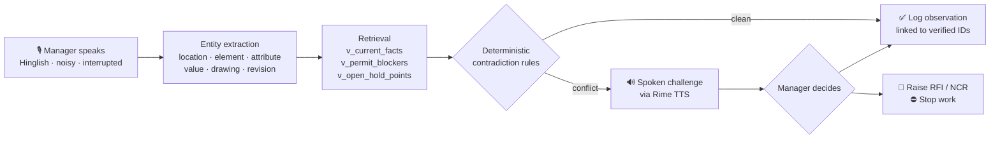

<div align="center">

# 🏗️ Vesper.ai

### Voice-led operational memory for construction sites

*The agent already knows your site. It challenges you **before** you log something wrong.*

<br/>


</div>

---

## 1. Short Summary

**Vesper** is a real-time, full-duplex voice agent for site managers on Indian construction
projects. You talk to it in Hinglish, on a noisy site, and it talks back — grounded entirely in
the project's own record: tender/BOQ, drawing revisions, RFIs, submittals, daily progress
reports, permits and QA/QC checklists.

Its defining behaviour is that it **argues with you**. When your spoken observation contradicts
the latest *For Construction* drawing, an unreleased hold point, or an unsatisfied permit check,
Vesper stops the log, says exactly what the record shows, and asks you to decide — log, raise an
RFI, raise an NCR, or stop work. Every number it speaks comes out of SQLite; none of it is
invented by the model.

> **Voice is the safety gate, not a transcription box.**

---

## 2. Problem Statement

Site managers live inside a fragmented information environment — tender/BOQ, the drawing
register, RFIs, submittals, DPRs, permits, QA checklists, plus a river of WhatsApp voice notes.

The real failure mode is **not missing data**. It is *contradictions* between:

| what was **tendered** | what is being **built** | what is **reported today** |
| :---: | :---: | :---: |

…and those contradictions surface only at the worst possible moment — rework, a payment dispute,
or an incident.

Procore, Aconex, RIB and SiteSetu unify documents into dashboards very well. But the manager
still has to correlate *a spoken observation* with *the right drawing revision / BOQ item / RFI*
**by hand, from memory, under time pressure.** And voice, today, is dictation or shallow Q&A —
it faithfully records the wrong number.

**A wrong number logged confidently is worse than no log at all.**

---

## 3. Our Approach

Vesper reframes voice from *capture* to *verification*. The runtime loop:



**1 · It opens with memory, not a menu.** Before it says a word, the agent has read the last
DPRs, open RFIs, submittals and hold points. It greets you with the actual state of the job —
*"Yesterday you were on L4 slab top bars and the pre-pour is still on hold over the cover
shortfall, RFI fifty is open."*

**2 · Extraction, then a deterministic check — not a vibe check.** The utterance becomes a
structured claim. Contradictions are decided by **rules over SQL views**, never by the LLM:

| Rule | Fires when |
| --- | --- |
| `dimension_mismatch` | spoken value ≠ latest fact, beyond stated tolerance |
| `revision_mismatch` | revision you cited ≠ latest *For Construction* revision |
| `permit_blocker` | a mandatory permit check is unsatisfied |
| `hold_point_blocker` | a QA/QC hold point has not been released |

**3 · It challenges you out loud, in your language.** Rime TTS speaks the correction in
Hinglish, with citations: *"Drawing A-102 ki latest revision R4 hai, jo 12 August ko issue hui
thi. Usme spacing 180 mm hai. RFI-047 ne yeh confirm kiya tha. Kya aap observation log karna
chahte hain, ya RFI raise karna chahte hain?"*

**4 · Nothing is written until a verified human decides.** A local **SpeechBrain ECAPA-TDNN**
speaker gate verifies it is the enrolled manager speaking before any logging tool can fire. If a
critical field is still uncertain, the agent **refuses to log** and asks again.

**5 · The LLM is on a short leash.** It plans the conversation and phrases the reply; the
grounded facts, contradictions and writes all come from the engine via typed tools
(`recall`, `check_observation`, `log_observation`, `raise_rfi`, `raise_ncr`, `stop_work`).

---

## 4. Tech Stack

| Layer | Technology | Role |
| --- | --- | --- |
| **Frontend** | Next.js 16 · React 19 · TypeScript · Tailwind v4 | Live / Observations / Scenarios / Enroll screens, site-memory panel |
| **Voice transport** | LiveKit Agents + `livekit-client` (WebRTC) | Real-time full-duplex audio, barge-in, interruption handling |
| **STT** | Groq Whisper (`livekit.plugins.groq`) | Hinglish speech → text on noisy sites |
| **TTS** | **Rime** (Arcana) via server-side proxy | Natural Hinglish spoken challenges; API key never reaches the browser |
| **LLM** | NVIDIA NIM (Nemotron 70B) *primary* → Groq *fallback*, OpenAI-compatible | Dialogue planning + phrasing, tool-calling only |
| **VAD** | Silero | Turn detection / barge-in |
| **Backend** | FastAPI + Uvicorn (`:8000`) | Deterministic engine, TTS proxy, speaker gate, scenario runner |
| **Engine** | Pure Python — `extract` · `numbers` · `contradictions` · `dialogue` · `replies` | Rule-based, testable, no model in the decision path |
| **Speaker ID** | SpeechBrain **ECAPA-TDNN** + PyTorch (CPU), FastAPI sidecar (`:8788`) | Cosine-similarity verification against the enrolled manager |
| **Data** | SQLite + `better-sqlite3` / stdlib `sqlite3` | 20 tables + 4 views (`v_current_facts`, `v_latest_drawings`, `v_permit_blockers`, `v_open_hold_points`) |
| **Testing** | Vitest (TS) · `scenarios.py` (S01–S10 acceptance harness) | Pass/fail table for scripted error + barge-in scenarios |

---

## 5. Run It Locally

**Prereqs:** Python 3.12+, Node 20+, a Chromium browser, and a filled-in `.env`
(`RIME_API_KEY`, `GROQ_API_KEY`, `NVIDIA_API_KEY`, `LIVEKIT_*`).

```bash
# 1 — build the project database (idempotent: run twice, get the same DB)
python3 data/build_db.py

# 2 — start all three services: voiceid :8788 · backend :8000 · frontend :3000
./run-all.sh

# 3 — in a second terminal, start the LiveKit voice agent
cd agent && ./run.sh
```

Then open **http://localhost:3000** → **Enroll** → record 3 live voice samples → **Live**.

> ⏳ The first `voiceid` boot downloads the ECAPA model (~80 MB) once.

<details>
<summary><b>Health checks & individual services</b></summary>

```bash
curl -s localhost:8000/api/health      # backend
curl -s localhost:8788/health          # speaker ID

./voiceid/run.sh                       # speaker ID only
./backend/run.sh                       # backend only
cd app && npm run dev                  # frontend only
```
</details>

<details>
<summary><b>Acceptance test — 10 scripted scenarios</b></summary>

Ten scenarios (S01–S10) carry deliberate errors and barge-in. **Pass** = all ten behave as
expected **and** zero observations are logged against the wrong drawing / dimension / location,
with every contradiction producing a spoken clarification first.

```bash
cd backend && PYTHONPATH=. .venv/bin/python scenarios.py
# or: POST http://localhost:8000/api/scenarios/run
```
</details>

<details>
<summary><b>Repository layout</b></summary>

```
app/                Next.js frontend (:3000) — Live · Observations · Scenarios · Enroll
  lib/engine/         TS reference implementation of the engine
  lib/parser/         extract · numbers
agent/              LiveKit voice agent worker
  worker.py           STT → LLM (tool-calling) → TTS pipeline
  engine_bridge.py    typed tools into the deterministic engine
  memory.py           site memory: DPRs, open RFIs, hold points
  voiceprofile.py     speaker gate wiring
backend/            FastAPI (:8000)
  CONTRACT.md         frozen HTTP + engine interface — all workstreams build to this
  engine/             extract · contradictions · dialogue · replies · llm
  scenarios.py        S01–S10 acceptance harness
voiceid/            SpeechBrain ECAPA speaker-ID sidecar (:8788) + enroll.py
data/
  schema.sql          SQLite schema (shared contract)
  build_db.py         builds site.db from raw/ + seed/
  seed/               demo project P1 + scenarios.json
  DATA.md             build steps, row counts, sanity checks, known gaps
landing/            Marketing landing page
DEMO.md             ~3 min live-mic demo script
.env                Secrets — gitignored, never commit
```
</details>

---

## 6. USPs

<table>
<tr>
<td width="50%" valign="top">

### 🛑 It challenges, it doesn't dictate
Every other voice tool records what you said. Vesper checks what you said against the
**latest For-Construction revision** and stops you *before* a wrong number becomes a record.

</td>
<td width="50%" valign="top">

### 🧠 Opens with memory, not a menu
No "which project?", no "who are you?". It has already read the last three DPRs, the open
RFIs and the hold points, and starts the conversation there.

</td>
</tr>
<tr>
<td width="50%" valign="top">

### 🔒 Deterministic where it matters
Contradictions come from **SQL views + explicit rules**, not from a language model. The LLM
phrases the sentence; it never decides whether you are wrong.

</td>
<td width="50%" valign="top">

### 🗣️ Hinglish-native, site-noise-real
Built for how Indian sites actually speak — code-switched, interrupted, loud. Groq Whisper in,
**Rime** Hinglish out, Silero VAD for genuine barge-in.

</td>
</tr>
<tr>
<td width="50%" valign="top">

### 👤 Voiceprint-gated writes
A local SpeechBrain ECAPA-TDNN model verifies the enrolled manager on every turn. No verified
speaker → **no write**, ever. Runs on-device, no key, no cloud round-trip.

</td>
<td width="50%" valign="top">

### 🚫 Refuses when uncertain
If a critical field is ambiguous, Vesper declines to log and asks again. Silence beats a
confident hallucination on a live pour.

</td>
</tr>
<tr>
<td width="50%" valign="top">

### 🔗 Every observation is traceable
Logs are written linked to a verified `drawing_id`, `location_id` and decision — not free text.
The audit trail is a foreign key, not a paragraph.

</td>
<td width="50%" valign="top">

### ✅ Measurably safe, not vibes-safe
A 10-scenario acceptance harness with deliberate errors and barge-in. The bar isn't "sounds
good" — it's **zero wrong logs**.

</td>
</tr>
</table>

---

<div align="center">
<sub>Built for DataForge × Rime · Demo script in <a href="./DEMO.md">DEMO.md</a> · Data notes in <a href="./data/DATA.md">DATA.md</a></sub>
</div>
