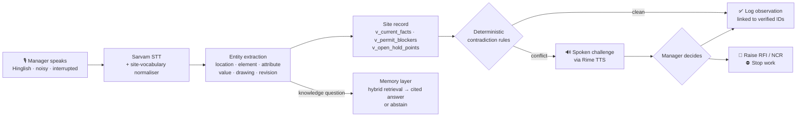
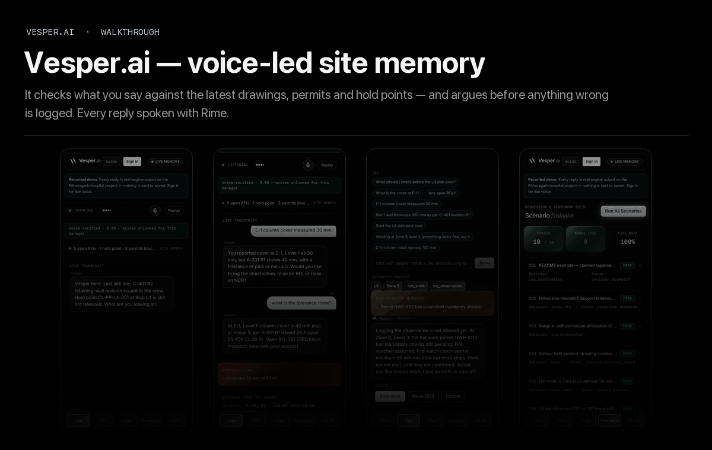
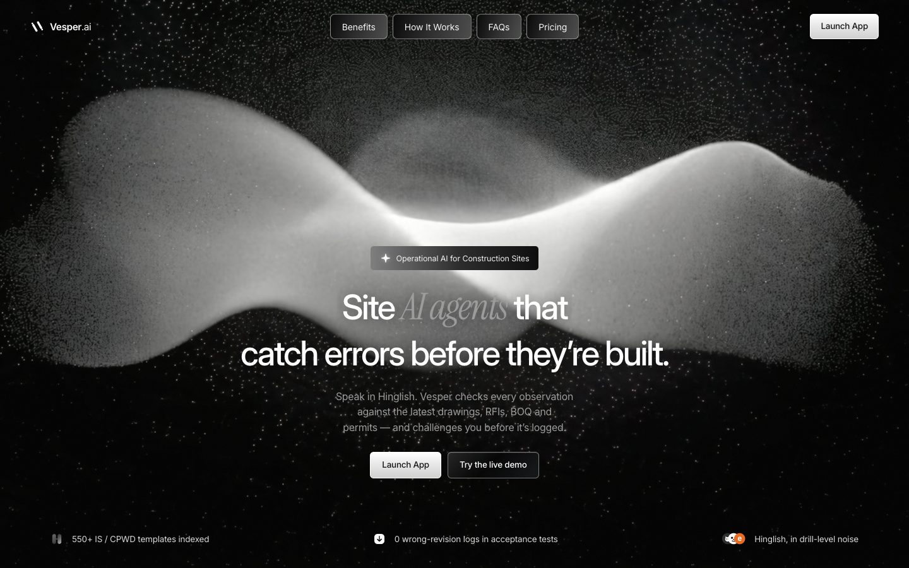
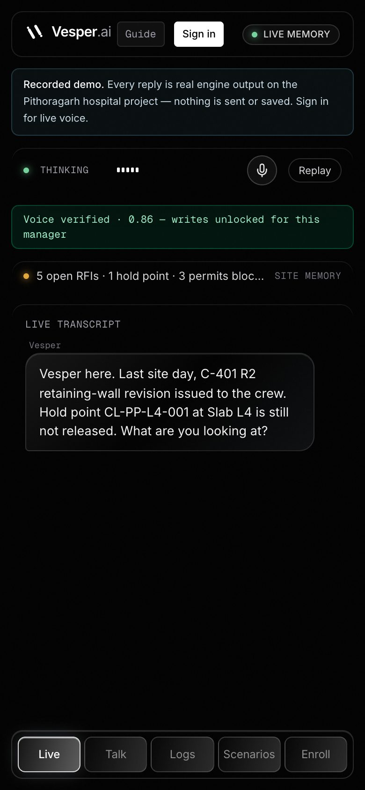
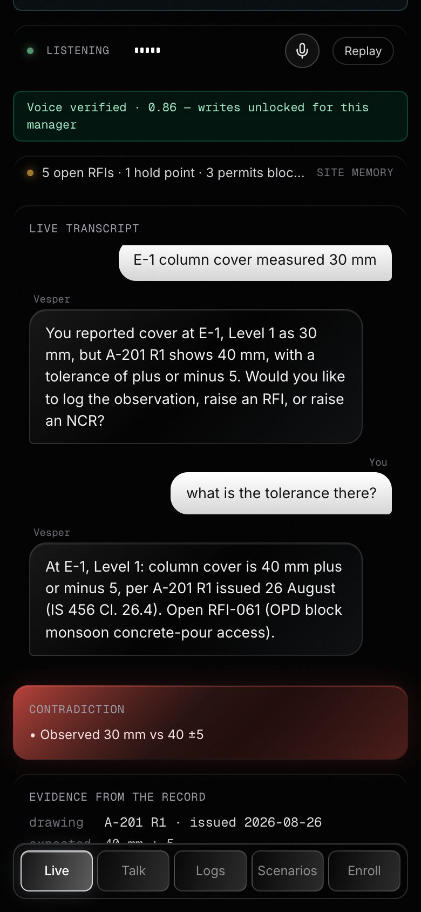
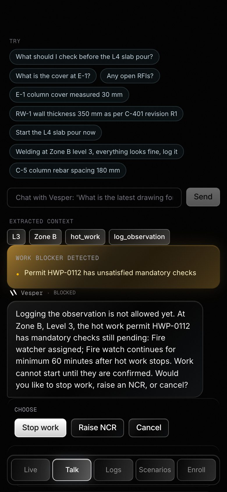

<div align="center">

# 🏗️ Vesper.ai

### Voice-led operational memory for construction sites

*The agent already knows your site. It challenges you **before** you log something wrong.*

<br/>


**[Try the dashboard](https://vesper-ai.pages.dev/app/)** · **[Hear the voice demo](https://vesper-ai.pages.dev/demo/)** · [Demo script](DEMO.md) · [Architecture](ARCHITECTURE.md) · [Rime evidence](RIME_EVIDENCE.md)

</div>

---

## 1. Short summary

**Vesper** is a real-time, full-duplex voice agent and laptop dashboard for site managers on Indian
construction projects. You talk in English, Hindi or Hinglish on a noisy site, and it talks back —
grounded in the project's own record (drawing revisions, RFIs, submittals, DPRs, permits, QA/QC
checklists, BOQ) and in a local memory of IS codes, 550 QA/QC/PMC templates, price and rate
references, thumb rules and every document the team uploads.

Its defining behaviour is that it **argues with you**. When a spoken observation contradicts the latest
*For Construction* drawing, an unreleased hold point or an unsatisfied permit check, Vesper stops the log,
says exactly what the record shows, and asks you to decide — log, raise an RFI, raise an NCR, or stop work.
Safety decisions come from deterministic rules over SQLite; knowledge answers come from retrieval with
citations, or an explicit "that isn't in the record".

> **Voice is the safety gate, not a transcription box.**

What's new in v2:

- **Memory layer** — local hybrid retrieval (bge-m3 vectors in LanceDB + SQLite FTS5 BM25 → RRF → cross-encoder
  rerank → abstain threshold) over ~20k chunks, a Cognee knowledge graph, and grounded answers with citations.
- **Multi-tenant onboarding** — Clerk Organizations for client companies, a 12-step project wizard (92
  real-world fields) whose answers become the project's prime memory, and Resend emails.
- **Ingest anything** — upload documents, paste text, or speak a voice briefing; searchable in seconds.
- **Laptop dashboard** — Linear-style shell, light/dark with Liquid Glass surfaces, ⌘K, Ask memory with a
  retrieval inspector, memory graph, site tables, scenarios and a Driver.js tour.
- **Sarvam STT** — `saaras:v3-realtime` for Indian speech plus a site-vocabulary normaliser; Groq Whisper is the fallback.

---

## 2. Problem statement

Site managers live inside a fragmented information environment — tender/BOQ, the drawing register, RFIs,
submittals, DPRs, permits, QA checklists, IS codes, plus a river of WhatsApp voice notes.

The real failure mode is **not missing data**. It is *contradictions* between:

| what was **tendered** | what is being **built** | what is **reported today** |
| :---: | :---: | :---: |

…and those contradictions surface only at the worst possible moment — rework, a payment dispute, or an incident.

Procore, Aconex, RIB and SiteSetu unify documents into dashboards very well. But the manager still has to
correlate *a spoken observation* with *the right drawing revision / BOQ item / RFI / code clause* **by hand,
from memory, under time pressure.** Voice today is dictation or shallow Q&A — it faithfully records the wrong number.

**A wrong number logged confidently is worse than no log at all.**

---

## 3. Our approach

Vesper reframes voice from *capture* to *verification*:



**1 · It opens with memory, not a menu.** The agent has read the last DPRs, open RFIs, submittals and hold
points, and greets you with the actual state of the job.

**2 · Extraction, then a deterministic check — not a vibe check.** The utterance becomes a structured claim.
Contradictions are decided by **rules over SQL views**, never by the LLM:

| Rule | Fires when |
| --- | --- |
| `dimension_mismatch` | spoken value ≠ latest fact, beyond stated tolerance |
| `revision_mismatch` | revision you cited ≠ latest *For Construction* revision |
| `unknown_drawing` | the drawing you cited isn't in the register |
| `permit_blocker` | a mandatory permit check is unsatisfied |
| `hold_point_blocker` | a QA/QC hold point has not been released |

**3 · It challenges you out loud.** Rime speaks the correction with citations and the choices you have.

**4 · Nothing is written until a verified human decides.** A local SpeechBrain ECAPA-TDNN speaker gate verifies the
enrolled manager before any write; each command's own utterance is re-verified at write time.

**5 · Knowledge questions go to memory, with receipts.** *"What cover does IS 456 require for columns?"* is
answered from retrieved clauses and templates with a citation (*per IS 456 clause 26.4*); *"today's gold
price?"* gets an explicit abstain. The LLM only phrases what retrieval returned.

---

## Screenshots

<p align="center">
  
  <br>
  <sub>Phone-console walkthrough, regenerate with <code>python scripts/build_walkthrough_gif.py</code>.</sub>
</p>

<table>
  <tr>
    <td colspan="6" align="center">
      <br>
      <b>Site AI agents that catch errors before they're built</b>
    </td>
  </tr>
  <tr>
    <td colspan="2" align="center" valign="top">
      <br>
      <b>Opens with site memory</b>
    </td>
    <td colspan="2" align="center" valign="top">
      <br>
      <b>Challenges contradictions</b><br>
      <sub>"E-1 column cover measured 30 mm" vs A-201 R1 (40 mm ± 5, IS 456 Cl. 26.4).</sub>
    </td>
    <td colspan="2" align="center" valign="top">
      <br>
      <b>Blocks unsafe work</b><br>
      <sub>Hot work refused: HWP-0112 lacks fire-watch checks.</sub>
    </td>
  </tr>
</table>

The laptop dashboard, onboarding and Ask memory are live at **[vesper-ai.pages.dev/app](https://vesper-ai.pages.dev/app/)**
on recorded product output — no sign-in, no keys. The spoken walkthrough is in [DEMO.md](DEMO.md).

---

## 4. Measured results

**Voice** (full claim, procedure and limitations in [RIME_EVIDENCE.md](RIME_EVIDENCE.md), run `20260911-003352`):

| | Result |
| --- | --- |
| Barge-in: manager cuts off a spoken challenge to correct E-1 → E-2 | Rime stops **1065 ms** after they start talking; correction held; stale challenge never resumed — **PASS** |
| Same question under drill noise, 5 dB SNR | answered correctly — **PASS** |
| A different voice says "log that observation" | voiceprint 0.03 < 0.70 → refused, nothing written — **PASS** |
| Enrolled manager says it | written, linked to A-201@R1 — **PASS** |
| End of turn → first audible Rime audio | median **1988 ms** with batch Whisper (target ≤ 1500 ms) — **MISS**; v2 moves live STT to Sarvam streaming, re-measurement pending |

**Engine** — `backend/scenarios.py`: **10 / 10** scripted scenarios with deliberate errors, garbled fields and
barge-in, **0 wrong logs**.

**Sarvam STT** — committed fixtures transcribed exactly (e.g. *"Wait, not E1, E2. Cover is 38 millimeters."*);
the normaliser maps real Whisper-era mishearings ("pit thoroughly / do pity / column even") to
"Pithoragarh / OPD / E-1".

**Memory** — warm hybrid search 20–130 ms per query on an Apple M3 laptop (16 GB) over ~20k chunks; cited
answers with Groq in ~1–3 s. Golden-set recall and abstain precision: `scripts/eval_memory.py`,
`docs/plan/reports/W1.md`.

---

## 5. Tech stack

| Layer | Technology | Role |
| --- | --- | --- |
| **Frontend** | Next.js 16 · React 19 · TypeScript · Tailwind v4 | Laptop dashboard (`/app`), onboarding (`/onboarding`), phone console (`/app/console`), landing |
| **Auth / tenancy** | Clerk (Organizations, session token v2) | Client company = org; projects per org; backend verifies JWT via JWKS |
| **Voice transport** | LiveKit Agents 1.8 + `livekit-client` (WebRTC) | Full-duplex audio, barge-in, data events |
| **STT** | **Sarvam** `saaras:v3-realtime` (live) / `saaras:v3` REST (uploads, Talk) → Groq Whisper `large-v3` fallback | Indian English / Hindi / Hinglish, plus `agent/stt_normalize.py` |
| **TTS** | **Rime** `mistv3`/`cove`/`eng` over websocket (live); HTTPS via `/api/tts` (Talk) | Every spoken reply; key never reaches the browser |
| **LLM** | Groq `openai/gpt-oss-120b` → Cerebras `gpt-oss-120b` → NVIDIA NIM | Grounded answer phrasing and slot filling only |
| **Memory** | Ollama `bge-m3` embeddings · `bge-reranker-v2-m3` · LanceDB · SQLite FTS5 · Cognee (Kuzu graph) | Hybrid retrieval, reranking, abstention, knowledge graph |
| **Backend** | FastAPI + Uvicorn (`:8000`) | Engine, memory, ingest, tenancy, TTS/STT proxies, scenario runner |
| **Engine** | Pure Python — `extract` · `numbers` · `answer` · `contradictions` · `dialogue` · `speech` | Rule-based, testable, no model in the decision path |
| **Speaker ID** | SpeechBrain ECAPA-TDNN sidecar (`:8788`) | Per-account voiceprint; fails closed |
| **Email** | Resend | Welcome, project created, invites, ingest complete |
| **Data** | `data/site.db` (engine), `data/app.db` (tenancy + memory tables), `data/memory/` (vectors, graph) | See [data/DATA.md](data/DATA.md) |
| **Testing** | `scenarios.py` (S01–S10) · `test_tenancy.py` · `scripts/eval_memory.py` · `scripts/voice_acceptance.py` · Vitest | |

Full request, identity, voice, memory, tenancy and deployment flows: [ARCHITECTURE.md](ARCHITECTURE.md).

---

## 6. Run it locally

**Prereqs:** Python 3.13, Node 20+, [Ollama](https://ollama.com), ~16 GB RAM, and a filled-in `.env` /
`backend/.env.local` (start from `.env.example`; never commit real keys).

```bash
# 0 — configure local secrets (gitignored)
cp .env.example .env

# 1 — build the engine database (idempotent)
python3 data/build_db.py

# 2 — local embedding model for the memory layer
ollama pull bge-m3

# 3 — start voiceid :8788 · backend :8000 · frontend :3000
./run-all.sh

# 4 — second terminal: the LiveKit voice agent
cd agent && ./run.sh

# 5 — third terminal: build the global memory (templates, P1 record, crawled IS code / prices / handbook)
backend/.venv/bin/python scripts/ingest_knowledge.py
```

Then open **http://localhost:3000** → sign in → **onboarding** (try **Prefill sample site**) → the dashboard.
Enroll your voice under **Settings** before logging anything by voice.

<details>
<summary><b>Health checks</b></summary>

```bash
curl -s localhost:8000/api/health       # db, llm, rime, voiceid, engine
curl -s localhost:8000/api/v2/status    # memory, ingest, tenancy routers loaded
curl -s localhost:8788/health           # speaker ID
```
</details>

<details>
<summary><b>Refresh the knowledge sources</b></summary>

```bash
python3 data/scraper/scrape_infralens.py --http-only      # 550 QA/QC/PMC template pages
python3 data/scraper/crawl_sections.py                    # IS code, prices, steel, SOR, rate analysis, handbook…
python3 data/scraper/crawl_sections.py --offline          # coverage report
python3 data/build_db.py                                  # rebuild site.db with template fields
```
</details>

<details>
<summary><b>Tests and evaluations</b></summary>

```bash
cd backend && PYTHONPATH=. .venv/bin/python scenarios.py     # 10 scripted scenarios, 0 wrong logs
cd backend && .venv/bin/python test_tenancy.py               # auth, org/project, isolation
backend/.venv/bin/python scripts/eval_memory.py              # retrieval recall, abstain precision, latency
agent/.venv/bin/python scripts/voice_acceptance.py           # live voice acceptance (see RIME_EVIDENCE.md)
cd app && npx tsc --noEmit
```
</details>

<details>
<summary><b>Repository layout</b></summary>

```
app/                  Next.js frontend (:3000)
  app/app/(dash)/       laptop dashboard routes
  app/onboarding/       org + project onboarding
  components/dashboard/ shell, pages, retrieval inspector, knowledge graph, tour
  components/onboarding/ wizard, prefill samples, IngestPanel, OnboardingGate
  lib/api-v2.ts         typed v2 client · lib/static-demo.ts recorded-demo mocks
agent/                LiveKit voice agent (Sarvam STT, normaliser, Rime, recall/search_memory tools)
backend/              FastAPI (:8000)
  engine/               deterministic engine
  memory/               embed · rerank · store · chunkers · ingest · retrieve · answer · api
  tenancy/              appdb · auth (Clerk) · validate
  routes/               memory · ingest · tenancy
  emails/               Resend sender + HTML templates
voiceid/              SpeechBrain ECAPA speaker-ID sidecar (:8788)
data/
  build_db.py · schema.sql · seed/     engine database for project P1
  scraper/                             template scraper + section crawler
  onboarding_schema.json               onboarding field schema
  app_schema.sql                       tenancy tables
docs/plan/            PLAN, PROGRESS, research notes and workstream reports
scripts/              demo builders, ingest, evaluations, voice acceptance, static deploy
```
</details>

### Seeded demonstration project

`P1` is a **synthetic Pithoragarh District Hospital & Staff Quarters** project for repeatable safety testing:
OPD/maternity columns E-1/E-2, the RW-1 retaining wall, revisioned drawings, RFIs, monsoon DPRs, permits,
hold points and observations. It is read-only for every account. Never treat seeded measurements as real
approvals — production projects must onboard and ingest their own approved drawings, RFIs, permits and records.

---

## 7. USPs

<table>
<tr>
<td width="50%" valign="top">

### 🛑 It challenges, it doesn't dictate
Every other voice tool records what you said. Vesper checks it against the **latest For-Construction
revision** and stops you *before* a wrong number becomes a record.

</td>
<td width="50%" valign="top">

### 🧠 Memory with receipts
IS codes, 550 QA/QC templates, prices and your own documents — every answer cites its clause or template,
or Vesper says it isn't in the record.

</td>
</tr>
<tr>
<td width="50%" valign="top">

### 🔒 Deterministic where it matters
Contradictions come from **SQL views + explicit rules**. The LLM phrases the sentence; it never decides
whether you are wrong.

</td>
<td width="50%" valign="top">

### 🗣️ Built for Indian sites
Sarvam hears Hinglish and Indian names, a normaliser fixes site IDs, Rime speaks back, Silero VAD handles
genuine barge-in over drill noise.

</td>
</tr>
<tr>
<td width="50%" valign="top">

### 🏢 Onboard a client in minutes
Clerk organizations, a realistic project wizard (contract, stakeholders, IS codes, cover, drawing
conventions, permits, hold points) that becomes the project's prime memory.

</td>
<td width="50%" valign="top">

### ✅ Measurably safe
A 10-scenario acceptance harness with deliberate errors and barge-in, a memory golden set, and a live voice
acceptance test. The bar is **zero wrong logs**.

</td>
</tr>
</table>

---

## 8. Rime voice contract

| Path | Model ID | Speaker | Language | Transport | Audio |
| --- | --- | --- | --- | --- | --- |
| **Live voice** | `mistv3` | `cove` | `eng` | LiveKit Agents `livekit-plugins-rime` 1.8 with `use_websocket=True`, delivered over LiveKit WebRTC | Rime PCM → Opus/WebRTC |
| Talk, English | `mistv3` | `cove` | `eng` | `POST https://users.rime.ai/v1/rime-tts` via the backend `/api/tts` proxy | `audio/mpeg` |
| Talk, Hinglish (organizer config) | `arcana` | `astra` | `hin` | same proxy | same |

- Every reply is spoken by Rime and shaped for the ear first (`backend/engine/speech.py`).
- The active provider is shown in the UI; the key stays server-side.
- Preflight: `python3 scripts/rime_preflight.py --env-file backend/.env.local [--request]`.

---

## 9. Third-party services and failure behaviour

| Service | Purpose | Failure behaviour |
| --- | --- | --- |
| Rime | Spoken output | Live plugin retries; text reply still shown. Talk falls back to browser speech with a visible badge. |
| Sarvam | STT (live streaming + REST) | Automatic fallback to Groq Whisper; typed input stays available. |
| Groq / Cerebras / NVIDIA | Answer phrasing, slot filling | Falls through the chain on error/timeout; engine decisions never depend on it. |
| Ollama + local reranker | Memory embeddings and reranking | Memory endpoints error clearly; the engine and site record keep working. Ask never falls back to the logging engine. |
| Resend | Emails | Never blocks a request; failures logged to `email_log`. |
| LiveKit Cloud | Voice transport | Token minting fails clearly; typed mode remains. |
| SpeechBrain sidecar | Speaker verification | Fails closed: writes locked, questions still answered. |

## 10. Authentication and deployment

- `/` is public; `/app` and `/onboarding` require Clerk. Users without an organization are sent to Vesper's
  own `/onboarding/org` (pending sessions are accepted in `app/proxy.ts`).
- Clerk dashboard: enable **Organizations**, keep session token v2, add the session claim
  `{"email":"{{user.primary_email_address}}"}`, and set `CLERK_JWT_ISSUER` for the backend.
- Resend: build templates with the variable names in `docs/plan/reports/W2.md`, set `RESEND_TEMPLATE_*`, and
  use a verified domain in `RESEND_FROM` to email anyone other than the account owner.
- Split hosting: Next.js frontend on Vercel; FastAPI API, VoiceID and the LiveKit agent on Render
  (`render.yaml`). The memory layer needs a machine with ~16 GB RAM for the local models.

The public link **[vesper-ai.pages.dev](https://vesper-ai.pages.dev)** is a static, key-free build: the landing
page, the laptop dashboard at `/app/` and onboarding on recorded product output, and the phone console replay at
`/demo/`. Build and deploy with:

```bash
backend/.venv/bin/python scripts/build_dashboard_demo.py   # record memory answers from a running backend
scripts/build_static_demo.sh deploy                         # STATIC_DEMO=1 export → Cloudflare Pages
```

`STATIC_DEMO=1` exports only `*.static.tsx` routes, aliases `@clerk/nextjs` to a stub, and answers API calls
from recorded JSON. The build fails if anything secret-shaped appears in the output.

## 11. Known limitations

- The scenario harness and voice acceptance use scripted/synthetic audio, not a physical phone on a live slab.
- Live-voice latency has not been re-measured since the move to Sarvam streaming STT.
- The memory layer runs local models; on 16 GB machines the embedding model, reranker and ingest compete for
  RAM, so first queries after a restart are slow and bulk ingest takes minutes.
- Cognee graph extraction is limited to project datasets and a curated subset of the global corpus.
- Tenancy gaps: no invite revocation or member removal endpoint, org membership is mirrored from Clerk tokens
  rather than webhooks, GSTIN check digit isn't verified.
- Rime, Sarvam, Groq, LiveKit, Clerk and Resend are external services: credentials, quota and network affect
  live behaviour.

---

<div align="center">
<sub>Built for DataForge × Rime · <a href="./DEMO.md">Demo script</a> · <a href="./data/DATA.md">Data notes</a> · <a href="./docs/plan/PROGRESS.md">Build log</a></sub>
</div>
